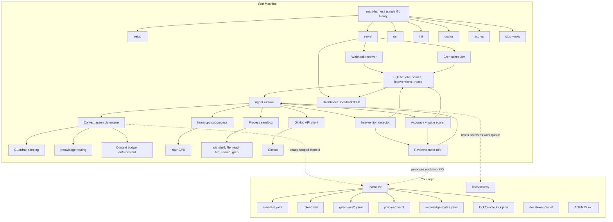

# Mars Harness — Architecture

## System Overview

Mars Harness is a single Go binary that runs as a persistent server managing an autonomous AI delivery pipeline. It receives GitHub webhook events, schedules cron-triggered jobs, executes agent roles against repos using local LLM inference, and tracks quality through accuracy scoring and self-improvement.

## Core Architecture



## Component Responsibilities

### CLI (`cmd/mars-harness/`)

Single entry point with subcommands: `setup`, `serve`, `run`, `init`, `doctor`, `status`, `scores`, `interventions`, `trust`, `models`, `stop`, `upgrade`.

### Agent Runtime (`internal/agent/`)

The core execution loop. Takes a role prompt + tools, calls the LLM, executes tool calls in a sandbox, feeds results back, and repeats until done or budget exhausted. Synchronous single-threaded per job; concurrency is at the job level.

### LLM Client and Router (`internal/llm/`)

OpenAI-compatible HTTP client. The router maps roles to model endpoints based on the manifest. Supports local llama.cpp, external vLLM, and cloud API fallback — all through the same interface.

### Local Inference (`internal/inference/`, `internal/models/`, `internal/hardware/`)

Manages llama.cpp as a subprocess. Auto-detects GPU hardware, downloads appropriate model weights, starts/stops/restarts the inference server, and health-checks it.

### Tool System (`internal/tools/`)

Typed tool registry with JSON Schema definitions. Core tools: `file_read`, `file_write`, `file_search`, `grep`, `shell_exec`, `git_*`, `github_pr_*`, `github_check_*`. Per-role tool allowlists enforced from the bundle.

### Context Assembly (`internal/context/`)

Builds the system prompt from: role prompt + in-scope guardrails + knowledge routes + trigger context. Enforces context budgets per role. Everything else is retrieved on demand via tools.

### Bundle Resolver (`internal/bundle/`)

Reads `.harness/` from a repo at a specific commit SHA. Parses manifest, role prompts, guardrails, policies, knowledge routes. Computes content hash for auditability.

### Job Queue (`internal/queue/`)

SQLite-backed. Schema includes `repo_id` from day one (multi-repo ready). Per-repo serialization via advisory locking. Idempotency keys prevent duplicate jobs from webhook replay.

### Sandbox (`internal/sandbox/`)

Process-level isolation. Linux: PID, mount, network namespaces. macOS: process groups with filesystem restrictions. Fresh working directory per job with repo cloned at target SHA.

### Scoring (`internal/scoring/`)

Tracks real outcomes via GitHub events (PR merged/closed, CI status, review approvals). Computes per-role rolling accuracy score. Detects noops-when-work-available (value scoring).

### Progressive Autonomy (`internal/trust/`)

Three trust levels: observer (comment only), contributor (PR with human approval), autonomous (auto-merge). Driven by accuracy scores with configurable thresholds per role. Trial mode for cold start.

### Self-Improvement (`internal/evolution/`)

Intervention detector monitors GitHub for human actions on harness PRs. Reviewer meta-role analyses failures, classifies root causes, and proposes evolution PRs to `.harness/`. Before/after tracking validates improvements.

### Guardrails (`internal/guardrails/`)

Advisory (prompt-injected, best-effort) and hard (mechanically validated, blocking) tiers. Override mechanism with logging. Staleness detection for unused guardrails.

### Dashboard (`internal/dashboard/`)

Server-rendered HTML at `localhost:9090`. htmx for live updates, Chart.js for graphs, SSE for streaming. Five pages: pipeline flow, role health, throughput, debug, evolution history. All static assets embedded in the Go binary.

### Safety (`internal/safety/`)

Blast radius containment: max changed files/lines per PR, file deletion allowlist, rate limiting, secret scanning. Emergency stop: halt jobs, cancel queue, clean up GitHub state.

## Bundle Format (`.harness/`)

```
.harness/
  manifest.yaml             # Roles, triggers, models, budgets, trust thresholds
  roles/
    engineer.md             # Prompt for each role
    pipeline-fixer.md
    ceo.md
    ...
  guardrails/
    architecture.yaml       # Hard + advisory rules
    conventions.yaml
    security.yaml
  policies/
    file-allowlist.yaml     # Per-role write restrictions
    egress-policy.yaml      # Network rules
    merge-policy.yaml       # Auto-merge rules
    blast-radius.yaml       # Max files, max lines, rate limits
  knowledge-routes.yaml     # "When working on X, read Y"
  lock/
    bundle.lock.json        # Content hash + model weight hashes
```

## Data Flow

1. **Event arrives** (webhook or cron schedule)
2. **Normalized** into a common event struct
3. **Deduplicated** via idempotency key
4. **Job created** in SQLite queue
5. **Dispatcher claims** the job (respects per-repo serialization)
6. **Bundle resolved** at the commit SHA
7. **Context assembled** (role prompt + scoped guardrails + trigger context)
8. **Agent loop runs** in a sandbox with tools available
9. **Output validated** against hard guardrails and blast radius limits
10. **GitHub operations** executed (PR, comment, check run) gated by trust level
11. **Outcome tracked** and scored when observable (PR merged/closed, CI status)
12. **Self-improvement triggered** if score below threshold or intervention detected
