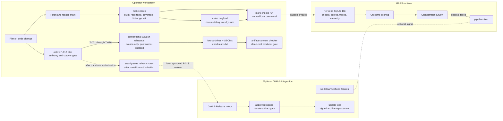

# MARS - Architecture

## System Overview

MARS is a single Go binary and repo-owned operating system for local
autonomous delivery. It installs local inference support, initializes target
repositories with an agent harness, registers repos into an isolated SQLite
runtime, executes role jobs through a bounded tool registry, records traces and
telemetry, scores real outcomes, adjusts trust, and turns failures into durable
work.

The deployed harness uses local models by default. Universal harness surfaces
are model-provider agnostic: tools, MCP transport, trust policy, context routing,
and generated documentation must work for local harness agents and any
MCP-compatible client without assuming frontier cloud model access.

The source repo is also a software factory. Operating doctrine, mirrored tools,
release rules, target harness defaults, and generated documentation all evolve
together. Changes that affect how agents work must be symbiotic with the
existing closed loop: goals, BDD feature contracts, active plans, tickets,
evidence, release, scoring, trust, and self-improvement.

## Core Architecture

```mermaid
flowchart TB
  subgraph LocalMachine ["Developer or operator machine"]
    CLI["mars single Go binary"]
    CONFIG["~/.mars config, caches, per-repo DBs"]
    LLM["Local or compatible LLM endpoint"]
    LLAMA["llama.cpp server subprocess"]
    GPU["Local GPU or CPU fallback"]
    DASH["Dashboard and HTTP API"]
    MCPCLIENT["MCP-compatible client or local harness agent"]

    CLI --> SETUP["setup / path setup"]
    CLI --> UPDATE["update check / tool / harness"]
    CLI --> CHECKS["checks run"]
    CLI --> RELEASE["release notes / backfill-notes"]
    CLI --> TARGETOPS["init / upgrade / scan / register"]
    CLI --> EXECOPS["start / serve / run"]
    CLI --> TOOLOPS["tools list / run"]
    CLI --> MCPOPS["mcp serve"]
    CLI --> HEALTH["doctor / scores / trust / models"]

    SETUP --> CONFIG
    UPDATE --> CONFIG
    CHECKS --> QUEUE
    RELEASE --> SOURCE["mars source repo"]
    SOURCE --> SNAPSHOT["pinned snapshot workflow"]
    SNAPSHOT --> DIST["Local dist/ snapshot artifacts"]
    TARGETOPS --> TARGET["Target repository"]
    EXECOPS --> SERVER["Orchestrator server"]
    TOOLOPS --> TOOLS["Built-in tool registry"]
    MCPOPS --> TOOLS
    MCPCLIENT -. stdio MCP .-> MCPOPS
    HEALTH --> CONFIG

    LLAMA --> GPU
    SERVER --> DASH
    SERVER --> QUEUE["SQLite: repos, jobs, scores, trust, traces, telemetry"]
    SERVER --> SCHED["Cron and manifest triggers"]
    SERVER --> WEBHOOKS["Webhook receiver"]
    SERVER --> WORKERS["Worker pool"]
    WORKERS --> AGENT["Agent runtime"]
    AGENT --> CONTEXT["Context assembly"]
    AGENT --> TOOLS["Built-in tool registry"]
    AGENT --> LLM
    LLM -. local default .-> LLAMA
    AGENT --> TRACE["Trace recorder"]
    TRACE --> QUEUE
    AGENT --> SCORE["Scoring and telemetry"]
    SCORE --> QUEUE
    SCORE --> EVOLVE["Self-improvement triage"]
    EVOLVE --> TICKETS["Intervention-debt tickets and evolution work"]
  end

  subgraph TargetRepo ["Initialized target repository"]
    AGENTS["AGENTS.md"]
    MANIFEST[".harness/manifest.yaml"]
    ROLES[".harness/roles/*.md"]
    GUARDRAILS[".harness/guardrails/*.yaml"]
    KNOWLEDGE[".harness/knowledge/*.yaml"]
    SKILLS[".harness/skills/*/SKILL.md"]
    METADATA[".harness/metadata.yaml"]
    GOALS["docs/goals/"]
    FEATURES["docs/features/"]
    PLANS["docs/exec-plans/"]
    TICKETDOCS["docs/tickets/"]
    QUALITY["docs/QUALITY_SCORE.md"]
    DESIGN["docs/design-docs/"]
    REFS["docs/references/"]
  end

  subgraph OptionalServices ["Optional external integrations"]
    GHREL["GitHub Release mirror"]
  end

  RELEASE -. optional mirror .-> GHREL
  CONTEXT -. reads .-> AGENTS
  CONTEXT -. reads .-> MANIFEST
  CONTEXT -. routes .-> KNOWLEDGE
  CONTEXT -. includes .-> ROLES
  CONTEXT -. scopes .-> GUARDRAILS
  AGENT -. uses .-> SKILLS
  TOOLS -. mutate within policy .-> TargetRepo
  TICKETS -. writes .-> TICKETDOCS
  SCORE -. exports .-> QUALITY
  UPDATE -. checks drift .-> METADATA
```



## Product Layers

MARS has six visible layers:

| Layer | Primary surface | Responsibility |
| --- | --- | --- |
| Install and setup | `setup`, `path setup`, config, model cache | Prepare a local machine, configure PATH, detect hardware, install or check inference assets, and report actionable setup gaps. |
| Target harness | `init`, `upgrade`, `.harness/`, generated docs | Give each target repo a compact mirrored operating system for agents and humans. |
| Execution | `run`, `start`, `serve`, queue, scheduler, workers, tools, traces | Execute roles against a registered repo with explicit tool allowlists and trust-gated mutation. |
| Delivery model | goals, BDD feature contracts, one active exec plan, tickets, evidence | Keep work tied to outcomes and prove scenarios before calling feature work done. |
| Learning loop | scores, trust, telemetry, quality score, skills, guardrails, decisions | Convert outcomes and failures into trust changes, intervention work, and reusable procedure. |
| Release state | `release notes`, release snapshots, future approved tags/assets, `CHANGELOG.md`, `VERSION` | Version source and target changes, produce and verify source snapshots, and gate any publication through the active release plan. |

## Local Delivery Architecture

MARS treats local execution as the authoritative delivery path. GitHub can
still receive webhooks and may host a future approved release, but repo-owned
gates, recorded check outcomes, repair routing, private snapshot production,
and artifact verification run locally through the harness. During F-018 the
source producer has no tag, upload, signing, or publication authority.



The important boundary is that local checks and current private rehearsal
evidence are source of truth. Later approved GitHub publication can add
distribution reach, but
they do not replace the local gates.

## CLI Contract

`cmd/mars/` is the single command entry point. The current implemented
surface is:

| Command | Purpose |
| --- | --- |
| `mars version` | Print version, OS/architecture, commit, and build date. |
| `mars setup` | Create config/cache state, configure supported shell profiles, detect hardware, and install inference assets unless skipped. |
| `mars path setup` | Idempotently add the install directory to supported user shell profiles. |
| `mars update check --repo <path>` | Report installed CLI, remote release, target metadata, and mirrored operating-model drift. |
| `mars update tool` | Upgrade or reinstall the installed binary from release assets or source-development mode. |
| `mars update harness --repo <path>` | Fill missing generated target harness defaults without overwriting user-owned files. |
| `mars init --repo <path>` | Scaffold `.harness/`, target `AGENTS.md`, goals, BDD features, tickets, exec plans, design docs, references, release state, and quality score. |
| `mars upgrade --repo <path>` | Preserve existing target policy while adding missing generated defaults. |
| `mars scan --repo <path> --tickets` | Scan a repo for starter findings and optionally create deduplicated backlog tickets. |
| `mars register --repo <path>` | Register a repo into the configured SQLite database. |
| `mars start --repo <path>` | Auto-init if needed, register the repo, seed the CEO role, and run the per-repo orchestrator. |
| `mars serve` | Run the legacy multi-repo orchestrator, dashboard, webhooks, cron scheduler, workers, and recovery watchdog. |
| `mars run <role> --repo <path>` | Execute one role against a target repo, with `--dry-run` for prompt preview. |
| `mars checks run --repo <path> --name <name> -- <command...>` | Run a named local delivery check, record pass/fail in the repo database, and feed failed checks into scoring and pipeline repair routing. |
| `mars tools list [--json]` | List the universal registered built-in tool surface available to foundation and deployed harness contexts. |
| `mars tools run <name> --repo <path> --args-json <json>` | Execute one registered tool through the same executor, allowlist, trust policy, repo root, and JSON argument path used by agent runs. |
| `mars mcp serve --repo <path>` | Expose registered tools through stdio MCP so any MCP-compatible client or local harness agent can use MARS tools through a model-provider-agnostic tool mechanism. |
| `mars doctor [--repo <path>] [--json]` | Diagnose setup, models, DB, repo, guardrail/workflow health, operating-model drift, active-plan hygiene, and integration state. |
| `mars scores [--repo <path>]` | Print stored role scores. |
| `mars scores export --repo <path>` | Refresh `docs/QUALITY_SCORE.md` from score, telemetry, ticket, dogfood, guardrail, check, no-op, and human-follow-up evidence. |
| `mars trust [--repo <path>]` | Show role trust levels. |
| `mars trust set <role> <repo> <level> --reason <text>` | Apply an audited trust override. |
| `mars models evaluate` | Print or run model evaluation probes against an OpenAI-compatible endpoint. |
| `mars release notes --repo <path> --bump auto` | Generate semantic patch notes, update `VERSION`, `CHANGELOG.md`, and source build info. |
| `mars release publish-assets` | Retired by T-065; source production now uses the conventional Go/Syft/GitHub-attestation workflow under the active plan, while targets own their producer. |
| Dormant source release workflow | Build and verify the MARS archive/SBOM/checksum contract, attest in a separate job, and publish only after explicit cutover authority enables the otherwise-dormant jobs. |

There is no current top-level `status`, `interventions`, or `stop --now`
command. Graceful stop is exposed through Ctrl+C, terminal key `q`, and the
dashboard/API stop controls while `start` or `serve` is running.

## Component Responsibilities

### CLI (`cmd/mars/`)

Owns all operator and agent-facing commands. CLI commands must produce
actionable errors, prefer repo-local defaults, and keep setup/update/release
flows usable from outside the source checkout.

### Config, Build Info, and Updates (`internal/config/`, `internal/buildinfo/`, `internal/updatecheck/`, `internal/selfupdate/`, `internal/shellpath/`)

Config holds local runtime paths and integration settings. Build info carries
the packaged version. Update checks compare the installed binary, target
metadata, release availability, and mirrored operating-model health. Release-mode
self-update accepts only the canonical signed archive contract: it verifies the
offline Sigstore bundle over the exact checksum bytes, immutable tag and full
commit, platform/build metadata, archive digest and structure, then durably
replaces or restores the fixed installed command before reusing shell path setup.

### Scanner and Generated Harness (`internal/scanner/`)

Scans repos for starter findings, creates deduplicated tickets, and owns the
generated target harness defaults. `init` and `update harness` write missing
defaults only; target-owned manifests, prompts, guardrails, knowledge routes,
tickets, docs, and `AGENTS.md` are preserved after initialization.

### Bundle and Context (`internal/bundle/`, `internal/context/`)

The bundle reader loads `.harness/manifest.yaml`, role prompts, guardrails, and
knowledge routes from the target repo. Context assembly builds the role system
prompt from the role definition, routed knowledge, scoped guardrails, trigger
payload, and context budget. Retrieval remains tool-driven rather than stuffing
every document into each prompt.

### Agent Runtime (`internal/agent/`)

Runs the synchronous conversation loop for one job: call the LLM, parse tool
calls, execute allowed tools, return observations, and stop on completion,
budget exhaustion, max turns, or error. Concurrency is owned by the worker pool,
not by a single agent loop.

### LLM Client, Router, and Local Inference (`internal/llm/`, `internal/inference/`, `internal/models/`, `internal/hardware/`)

The LLM client speaks the OpenAI-compatible HTTP shape used by local llama.cpp
and compatible model servers, but the architecture does not require frontier
cloud models. Deployed harnesses default to local inference. Local inference
manages llama.cpp as a subprocess, detects hardware, downloads or verifies model
weights, starts and stops the server, and health-checks it. Model evaluation
prints the current candidate plan or probes a supplied compatible endpoint.
When an operator configures a hosted or cloud endpoint, MARS sends the selected
assembled context, model messages, tool schemas, tool arguments, and tool
results needed for that conversation to the endpoint under its provider terms.

### Tool System (`internal/tools/`)

The tool registry exposes typed tools with JSON Schema definitions. Built-ins
are registered in code and then filtered by the current role allowlist. Empty
allowlists fail closed. Mutating tools are blocked at observer trust and pass
through repository-root checks, guardrails, safety limits, and secret scanning
where applicable.

The universal tool surface is the same registry exposed three ways:

- role tool allowlists during MARS agent runs
- `mars tools list/run` for operator and smoke-test workflows
- `mars mcp serve` for MCP-compatible clients and local harness agents

This surface is intentionally model-provider agnostic. It describes capability
transport, schemas, trust, and execution policy, not where inference runs.

Current mirrored built-in tools are:

- `file_read`, `file_write`, `file_search`
- `grep`, `shell_exec`
- `mars_cli`
- `record_decision`
- `ticket_create`
- `tool_create`
- `release_orchestrate`, `github_release_status`, `git_release_guard`
- `architecture_audit`, `harness_doctrine_sync`, `tool_creation_guard`,
  `tool_inventory_audit`
- `task_trace_summarize`
- `git_status`, `git_diff`, `git_commit`, `git_push`

`docs/design-docs/tools-glossary.md` is first-class mirrored context for tool
availability and selection. New tools must extend that glossary and the
generated target copy in the same change.

### Queue and Server (`internal/queue/`, `internal/serve/`, `internal/scheduler/`, `internal/github/`)

SQLite is the runtime system of record for repos, jobs, scores, trust, traces,
telemetry, and related state. Jobs carry `repo_id`, role, trigger payload, and
idempotency key. Claiming is atomic and prevents concurrent jobs for the same
repo while allowing different repos to progress. `start` defaults to a per-repo
database; `serve` keeps the legacy multi-repo mode.

The server owns webhooks, cron triggers, recovery queue self-healing, worker
pool lifecycle, dashboard/API controls, role chaining, and self-improvement
checks.

### Sandbox, Safety, and Guardrails (`internal/sandbox/`, `internal/safety/`, `internal/guardrails/`)

Sandboxing is process-level. Linux probes PID, mount, and network namespaces
before applying clone flags, then degrades with a warning to process groups and
ulimit wrappers when namespaces are denied by the host. Operators can force the
fallback with `MARS_DISABLE_LINUX_NAMESPACES=1`. Non-Linux platforms
use process groups, current working directory restriction, and ulimit wrappers.
Current execution roots tools in the registered repo path; it does not clone a
fresh working directory per job.

Shell and subprocess execution has the current operating-system user's full
authority. Process groups, working-directory controls, resource limits,
allowlists, and guardrails reduce mistakes and blast radius; they are not a
security sandbox or a containment boundary for hostile code.

Safety and guardrails provide blast-radius limits, deletion policy, secret
scanning, blocked destructive operations, advisory prompt guidance, mechanical
validation, and auditability. Dashboard/API stop is graceful: it stops claiming
new work and shuts down running orchestration rather than pretending to roll
back already-landed commits.

### Scoring, Telemetry, Trust, and Quality (`internal/scoring/`, `internal/telemetry/`, `internal/trust/`, `internal/qualityscore/`)

Scores are based on real outcomes: successful completion, commits, checks,
guardrail blocks, max turns, noops, dogfood failures, reverts, human follow-up,
and repeated failure categories. Trust levels are `observer`, `contributor`,
and `autonomous`; trust gates mutating tools and role behavior.

`scores export` converts runtime evidence into `docs/QUALITY_SCORE.md`, keeps a
manual notes block, and can create deduplicated low-score intervention-debt
tickets. The dashboard should not become a separate quality source of truth.

### Self-Improvement and Learnings (`internal/evolution/`, `internal/learnings/`, `internal/docsconsistency/`, `internal/operatingmodel/`, `internal/planhygiene/`)

The learning loop triages failures before changing the system. Improvement
targets can be role prompts, skills, process, guardrails, context routes, tool
policy, manifest settings, scanner defaults, ticket flow, inference settings,
or generated target guidance. Docs consistency, operating-model checks, and
active-plan hygiene keep source and deployed harness doctrine aligned.

### Dashboard and UI (`internal/dashboard/`, `internal/ui/`)

The dashboard is server-rendered HTML with embedded assets and SSE updates. It
exposes status, queues, repos, roles, telemetry, quality links, and controls for
pause/resume, warm restart, scan, run-role, and graceful stop. The terminal UI
provides the same operational controls during `start` and `serve`: `p`, `r`,
`s`, `q`, and `h`.

### Release (`internal/release/`)

Release notes infer semantic versions from commits, update source build info,
and prepend generated changelog entries. MARS source production uses the
conventional Go/Syft/GitHub-attestation workflow defined by AD-315 and F-018.
The F-018 signed
archive consumer authenticates checksum bytes, identity, immutable source commit,
platform/build metadata, archive digest and structure before durable replacement.
Generated targets choose their own producer and verifier. The former standalone
`release verify-assets` and `release audit` commands are retired.

## Generated Target Harness Layout

`mars init` writes a deployed harness that is immediately usable by
local MARS roles, MCP-compatible clients, and humans:

```text
target-repo/
  AGENTS.md
  .harness/
    manifest.yaml
    metadata.yaml
    roles/
      ceo.md
      cto.md
      coo.md
      engineer.md
      ...
    guardrails/
      *.yaml
    knowledge/
      context-glossary.yaml
    skills/
      self-improvement/
        SKILL.md
  docs/
    goals/
    features/
    tickets/
      backlog/
      in-progress/
      done/
      README.md
    exec-plans/
      active/
      backlog/
      completed/
      superseded/
      README.md
    design-docs/
      index.md
      context-glossary.md
      harness-glossary.md
      tools-glossary.md
      release-versioning.md
    references/
    generated/
    QUALITY_SCORE.md
  VERSION
  CHANGELOG.md
```

Generated target docs mirror foundation doctrine while staying
project-agnostic. Upgrade/update commands write missing defaults and metadata
for drift detection, not destructive replacements of user-owned policy.

## Operating Model

MARS uses BDD-led, goal-driven walking-skeleton delivery:

1. Goals define outcomes and competing priorities.
2. BDD feature contracts define the intended capability.
3. The active exec plan ranks failing scenarios and states the hypothesis.
4. Tickets implement the next highest-value failing scenario or scenario group.
5. Engineers ship the thinnest real end-to-end slice that passes evidence.
6. Dogfood, QA, telemetry, quality score, release notes, and feedback update the
   loop.

The CEO owns goals, BDD contracts, scenario schedule, tradeoffs, and the active
plan. The CTO checks architecture fit and whether the walking skeleton is real.
The COO creates scoped tickets from the current failing scenario. Engineers
complete one ticket per run and supply scenario evidence before feature tickets
move to done. Janitor and orchestrator roles keep state truthful. Evolution
roles improve the harness only inside trust and safety limits.

No feature is shipped just because a ticket moved. Feature truth lives in BDD
scenario evidence.

Repeated, risky, validation-heavy, or likely-to-recur manual processes should
be formalized as tools. The tool is mirrored when it applies to both foundation
and deployed harnesses, documented in the tools glossary, added to generated
target defaults when appropriate, and tested before roles depend on it.

New built-in tools originate through `tool_create` before manual
implementation. Manual bypass requires a prior `record_decision` entry and
design-doc rationale so future agents can recover why the governed path was not
used.

## Data Flow

1. A command, webhook, cron trigger, dashboard action, telemetry pattern, or
   chain rule creates intent.
2. The target repo is auto-initialized when required by `start`, `register`,
   `run`, or `scan`.
3. The repo is resolved from the registry and the per-repo or configured SQLite
   database.
4. The event is normalized into a job with a repo ID, role, trigger payload, and
   idempotency key.
5. The queue deduplicates the job and atomically claims only work whose repo has
   no currently claimed/running job.
6. The executor loads the target harness, role prompt, manifest settings,
   guardrails, knowledge routes, trust level, and tool allowlist.
7. Context is assembled within the role budget.
8. The agent loop calls the configured OpenAI-compatible endpoint and executes
   only allowed tools through the tool executor.
9. Mutating tool calls are checked against trust, root boundaries, safety,
   guardrails, and secret scanning.
10. Trace, terminal output, telemetry, and job status are recorded.
11. Scoring consumes observable outcomes and updates role health.
12. Quality export, intervention-debt tickets, learnings, skills, prompt
   changes, manifest/tool-policy updates, or generated-harness updates are
   created when evidence supports them.

## Database Isolation

The default database is isolated per target repo for `start`, `register`, and
`doctor --repo`:

```text
~/.mars/db/{repo-name}/mars.db
```

`serve` uses the legacy shared path unless `--db` is supplied. Explicit `--db`
always wins. This keeps queue, telemetry, scheduling, trust, and registry state
from different projects physically separate by default.

## Release and Versioning Flow

The active release plan defines source version authority. During T-071 through
T-079:

1. Retain the `0.68.49` version floor and do not create a release-note commit.
2. Validate, commit, and push each bounded semantic checkpoint to `main`.
3. Run only the conventional no-publish producer and verification rehearsal;
   keep `.github/workflows/release.yml` dormant.
4. Defer tags, signing, uploads, and supported-release claims to the separately
   approved F-018/F-017 cutover.

After that transition is explicitly closed, the steady-state rule may resume:
`mars release notes --repo . --bump auto`, a `release: notes X.Y.Z` commit, and
the repository-owned producer under its then-current authority.

Initialized target repos receive the same release-note discipline through
generated guidance, adjusted to their own release capability.

## Source of Truth

- First-read operating guidance: `AGENTS.md`
- Tenets: `docs/design-docs/tenets.md`
- Product surface: `docs/product-specs/product-surface.md`
- Operating model: `docs/design-docs/delivery-operating-model.md`
- Harness terminology: `docs/design-docs/harness-glossary.md`
- Tool availability and use cases: `docs/design-docs/tools-glossary.md`
- Architecture decisions: `docs/design-docs/index.md`
- Active work: `docs/exec-plans/active/current-operating-plan.md`
- Quality evidence: `docs/QUALITY_SCORE.md`

Architecture changes should update this file when they change command surfaces,
runtime components, generated target layout, operating flow, persistence,
tooling, release behavior, or trust/safety boundaries.
