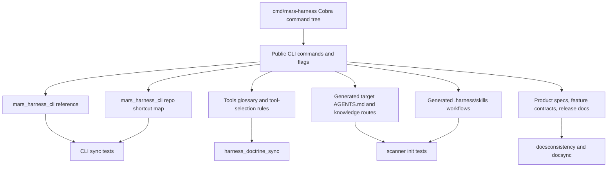

# AD-103: CLI Tool And Skill Synchronization Operating Model

**Status:** Accepted
**Date:** 2026-05-04
**Owner:** Mars Harness maintainers
**Related:** AD-052, AD-055, AD-079, AD-101, AD-102, F-001, F-005
**Mirrors:** Generated target `docs/design-docs/cli-tool-skill-sync.md`

## Context

The `mars-harness` CLI is the primary control surface for operators, local
agents, MCP clients, generated target harnesses, release workflows, and recovery
procedures. It is also exposed back to agents through the mirrored
`mars_harness_cli` tool, role allowlists, generated target guidance, and compact
skills that describe recurring workflows.

That creates a stale-documentation risk with real product impact. A command can
be added to `cmd/mars-harness/main.go`, but agents may still operate from an old
`mars_harness_cli` reference. A command can gain or change a `--repo` flag, but
the tool's repo shortcut can keep appending paths only for the old set. A
workflow can move from shell commands into a first-class CLI command, but the
generated skills and tool-selection docs may still tell agents to use the older
path.

The foundation harness therefore needs an explicit operating model: CLI changes
are not done until the skills and tools that route to the CLI are synchronized.

## Decision

Mars Harness treats CLI-to-tool-and-skill synchronization as a foundation
operating rule.

Whenever the `mars-harness` CLI changes, the same change must review and update
the mirrored CLI surfaces:

- `mars_harness_cli` reference text;
- `mars_harness_cli` repo shortcut support map;
- tool descriptions, tool glossary, and tool-selection guidance;
- generated target role allowlists, knowledge routes, and AGENTS guidance;
- generated universal skills that name CLI workflows;
- product-surface docs, feature contracts, release guidance, and examples that
  describe CLI behavior.

The source of truth remains the Cobra command tree in `cmd/mars-harness`. The
mirrors exist so agents can discover and run the CLI safely without reading the
whole source tree or falling back to generic shell execution.

## Architecture



The architecture has five layers.

### 1. Authoritative CLI Layer

`cmd/mars-harness/main.go` owns the actual command tree, command aliases,
flags, examples, and behavior. Any change to this file is a CLI change unless
it is purely internal plumbing with no user-visible command, flag, output, or
workflow effect.

### 2. Mirrored Tool Layer

`internal/tools/mars_harness_cli.go` exposes two important mirrors:

- a reference mode that agents can read before calling the CLI;
- a run mode that executes structured argv and optionally appends a workspace
  `--repo <path>` shortcut for commands whose `--repo` flag is a local
  repository path.

Both mirrors must stay aligned with the Cobra command tree. The reference is a
human-readable command catalog; the repo shortcut map is executable routing
policy.

### 3. Skill And Doctrine Layer

Skills do not grant tool authority, but they teach repeatable procedures. If a
CLI change introduces, removes, or changes a recurring workflow, any generated
skill that tells agents how to perform that workflow must be updated in the
same change.

Generated target doctrine also mirrors CLI guidance through:

- `AGENTS.md` operations and working discipline;
- `.harness/manifest.yaml` role tool allowlists;
- `.harness/context-glossary.yaml` knowledge routes;
- `docs/design-docs/tools-glossary.md`;
- `docs/design-docs/skill-evolution.md`;
- `.harness/skills/<name>/SKILL.md` files.

### 4. Product And Documentation Layer

Public CLI changes update product-facing docs. The default review set is:

- `docs/product-specs/product-surface.md`;
- `docs/design-docs/tools-glossary.md`;
- `docs/design-docs/delivery-operating-model.md`;
- relevant `docs/features/F-*.md` contracts;
- release docs when the command participates in versioning or publication;
- generated target docs when target operators inherit the behavior.

### 5. Gate Layer

The following checks keep the mirrors synchronized:

- `go test ./cmd/mars-harness -run TestMarsHarnessCLI` compares the live Cobra
  command tree with the `mars_harness_cli` reference and repo shortcut map.
- `go test ./internal/tools -run TestMarsHarnessCLI` verifies the tool behavior
  directly.
- `go test ./internal/scanner -run TestInit_success` verifies generated target
  doctrine, skills, and tool guidance.
- `go test ./internal/docsconsistency/...` verifies operating-model docs.
- `mars-harness docsync audit --repo .` verifies changed source files point to
  the owning docs.
- `mars-harness tools run harness_doctrine_sync --repo . --args-json '{}'`
  checks mirrored doctrine when operating rules or generated defaults change.

## Universal Operating Model

### Step 1: Classify The CLI Change

Treat a change as CLI-affecting when it adds, removes, renames, aliases, or
changes:

- a command path;
- a public flag or flag meaning;
- default command behavior;
- command output consumed by agents or scripts;
- mutability, trust, or safety expectations;
- long-running/background behavior;
- repo, database, release, model, or target-harness routing.

### Step 2: Inventory The Mirrors

For every CLI-affecting change, review these surfaces before completion:

| Surface | What To Check |
| --- | --- |
| `mars_harness_cli` reference | Command path, flags, examples, mutability, dry-run guidance, JSON guidance. |
| `mars_harness_cli` repo shortcut map | Whether `repo:"."` should append `--repo <abs path>` or be rejected. |
| Tool glossary | Whether agents should prefer the CLI tool, a specific registered tool, or a skill. |
| Generated role allowlists | Whether target agents need `mars_harness_cli` or a narrower tool for the workflow. |
| Generated knowledge routes | Whether context assembly routes CLI work to current docs. |
| Generated skills | Whether a recurring CLI workflow needs compact procedural guidance. |
| Product and feature docs | Whether user-facing behavior or BDD completeness changed. |
| Release docs | Whether release, update, or asset workflows changed. |

### Step 3: Update The Tool Mapping

Update `internal/tools/mars_harness_cli.go` whenever:

- a command is added or removed;
- a command gains or loses a local workspace `--repo` flag;
- a command's `--repo` flag changes meaning;
- a command should be run in background mode;
- a command should be avoided in favor of a narrower first-class tool;
- examples or operational guidance are outdated.

Commands with a `--repo` flag that is not a local filesystem path, such as a
GitHub `owner/name` value, must not be added to the repo shortcut map.

### Step 4: Update Skills And Generated Doctrine

When the CLI change affects an agent workflow:

1. Update generated `.harness/skills/<name>/SKILL.md` content in
   `internal/scanner/init.go`, or create a new compact skill when the workflow
   is reusable and multi-step.
2. Update `.harness/context-glossary.yaml` generated routes so agents receive
   the right CLI, tool, skill, and design-doc context.
3. Update generated `AGENTS.md`, tools glossary, and feature docs when target
   harnesses inherit the behavior.
4. Update scanner tests so fresh initialized targets prove the skill/tool/CLI
   mapping exists.

### Step 5: Update Product, Architecture, And BDD

CLI behavior is product behavior. A CLI change that affects users or agents
updates the relevant feature contract and product/design docs in the same
change. If the command is purely internal and docs remain current, the commit
or ticket evidence should say which docs were checked.

### Step 6: Run Evidence

Use this minimum evidence for CLI-affecting changes:

```bash
go test ./cmd/mars-harness -run TestMarsHarnessCLI
go test ./internal/tools -run TestMarsHarnessCLI
go test ./internal/scanner -run TestInit_success
mars-harness docsync audit --repo .
```

When generated doctrine, skills, or tool-selection rules change, also run:

```bash
go test ./internal/docsconsistency ./internal/scanner ./internal/tools
mars-harness tools run harness_doctrine_sync --repo . --args-json '{}'
```

For broader CLI work, run `go test ./...`.

### Step 7: Record Completion

Completion evidence should name:

- CLI commands or flags changed;
- tool reference and repo shortcut updates;
- skill or generated target changes;
- docs checked or updated;
- tests and audits run.

Release notes should explain CLI changes in Impact, Why, and What Changed
terms, including the agent/tool synchronization impact when relevant.

## Invariants

- Every runnable Cobra command is documented in the `mars_harness_cli`
  reference.
- Every runnable command with a local workspace `--repo` flag is accepted by
  the `mars_harness_cli` repo shortcut map.
- Commands whose `--repo` flag is not a local path are not accepted by the repo
  shortcut map.
- CLI changes update generated target doctrine when target agents inherit the
  workflow.
- Skills that name CLI workflows are updated when those workflows change.
- Tool-selection guidance explains when to use `mars_harness_cli` versus a
  narrower built-in tool.
- CLI-affecting commits include docsync and CLI-sync evidence.

## Failure Modes And Mitigations

| Failure Mode | Mitigation |
| --- | --- |
| New command exists but agents cannot discover it | Command-tree test fails until `mars_harness_cli` reference is updated. |
| Repo shortcut rejects a valid repo-aware command | Repo shortcut test fails until the map is updated. |
| Repo shortcut appends paths to a non-path `--repo` flag | Repo shortcut test keeps owner/name release flags out of the map. |
| Generated target skills keep old workflow steps | Scanner tests assert generated doctrine and skill text for inherited workflows. |
| Tool glossary still points agents at shell execution | Doctrine sync and docs review require tool-selection guidance updates. |
| Docs claim stale CLI behavior | Product, feature, and release docs remain in the `MarsDocSync` review set for CLI files. |

## Acceptance Criteria

- CLI command tree changes cannot pass `go test ./cmd/mars-harness` unless the
  `mars_harness_cli` reference covers every runnable command.
- Commands with local workspace `--repo` flags cannot drift from the
  `mars_harness_cli` repo shortcut map.
- Generated target docs include this operating model.
- Generated skill guidance tells agents to sync skills and tools when CLI
  workflows change.
- The design-doc index records this decision.
- Release notes for CLI changes describe the synchronized tool/skill impact.
