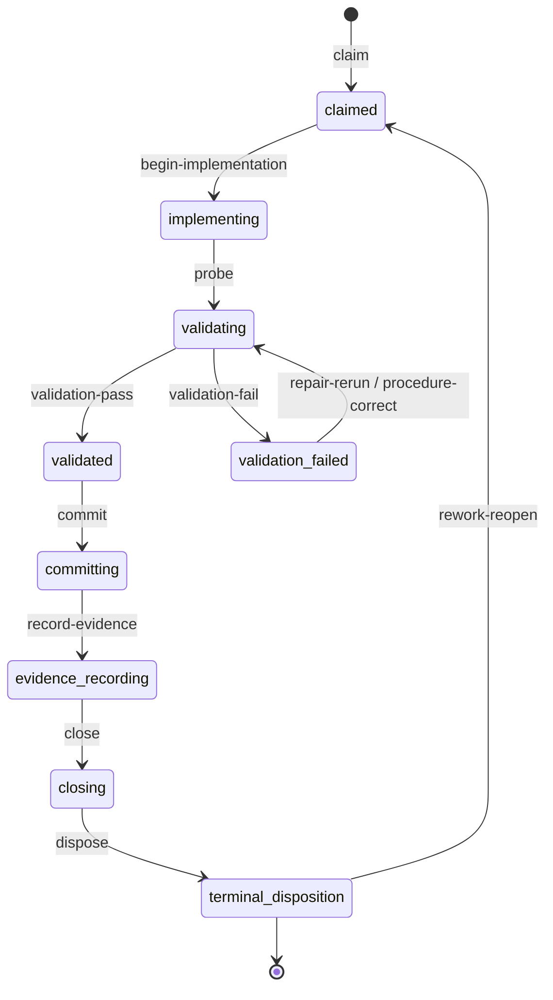

# Convergence State Machine

**Status:** Accepted
**Date:** 2026-06-12
**Author:** foundation-maintainer

The implicit delivery lifecycle that convergence guardrails enforce, made
explicit as a state machine with named states and transitions. This is the
T-028 design deliverable from the foundation improvement plan (WS-D); the
implementation (T-029-class slices) is explicitly out of scope here.

## Context

Convergence rules accreted as point fixes: each live-demo failure landed as
another inline rule in `internal/tools/policy.go`, recorded as an AD in
[delivery-operating-model.md](delivery-operating-model.md) (AD-164 through
AD-275, plus AD-207 in release-versioning.md and AD-208 in
context-efficiency.md). The rules are individually correct and live-validated,
but the lifecycle they collectively enforce — claim, implement, validate,
repair, commit, record evidence, close, dispose — exists only implicitly in
their interactions. Three costs follow:

1. **New rules are hard to place.** Every new convergence finding becomes a
   new free-floating policy function, growing the god file (see the
   decomposition AD) and risking ordering interactions nobody can see.
2. **Agents get stuck fighting blocks.** The dominant observed failure class
   in the 2026-06-11/12 baselines is `max_turns` spent against repeated
   guardrail blocks — the heavy-model demo-11 run's cto-weekly burned 51 LLM
   calls against ticket-policy blocks before max_turns at ~725s
   ([2026-06-11 report](../validation/reports/2026-06-11-demo-11-pace-baseline.md),
   Independent observer section). An agent in that condition is in a state
   without a visible permitted transition.
3. **Missing transitions are invisible.** The baselines surfaced three
   missing-transition classes — T-031's operator-retry routing gap ("not
   dispatching runtime failure through Orchestrator; foundation telemetry or
   operator retry must resolve it first"), post-max_turns handoff
   incompleteness (the demo-12 `ticket_gate` cascades), and the
   graceful-stop draining gap (T-035's orphaned pending job) — but nothing
   in the current model names the place where each transition should exist.

This doc is doctrine for the foundation harness and, through mirrored
role-guidance language, for deployed harnesses. It does not change runtime
behavior; per AD-284 this is a docs/doctrine-only change class (documentation
gates suffice; the first T-029 implementation slice takes the replay tax).

## Key Design Decisions

### AD-286: Convergence Rules Are Edge Guards On A Named State Machine

The delivery lifecycle is an explicit state machine. **Every convergence
guardrail is an edge guard on a named transition (or a named state's
self-loop boundary), never a free-floating policy.** New convergence rules
must declare, in their AD and in code, which transition they guard. A
proposed rule that cannot name its transition is evidence the state machine
is missing a state or transition — extend the machine first, then guard it.

#### Engineer delivery machine (per claimed ticket)

States:

| State | Meaning | Entry evidence |
| --- | --- | --- |
| `claimed` | Ordinary product ticket moved backlog → in-progress and the claim committed | claim move + commit |
| `implementing` | Product files mutating under the claimed ticket | first product `file_write` |
| `validating` | Running recognized validation (tests, builds, runtime probes, browser build + product smoke) | first validation command |
| `validation-failed` | An unexpected test/build or runtime validation failure is outstanding; two repair lanes: **test/build repair** and **runtime repair** | failing validation outcome |
| `validated` | Required validation evidence present, no outstanding failures | last required validation passes |
| `committing` | Staging and committing implementation plus ticket work | `git_commit` of product work |
| `evidence-recording` | Populating ticket `evidence_links`/`verified_by`, docsync evidence | ticket evidence `file_write` |
| `closing` | Ticket lifecycle move to `docs/tickets/done/`, lifecycle commit, push | `git mv ... done/` |
| `terminal-disposition` | `job_disposition_record` with status and `next_need` | terminal tool call |

Named transitions:

| Transition | Edge | Canonical trigger |
| --- | --- | --- |
| `claim` | (backlog) → `claimed` | claim-first ticket move (AD-137/AD-153 lineage) |
| `begin-implementation` | `claimed` → `implementing` | first product mutation |
| `probe` | `implementing` → `validating` | first validation command |
| `validation-pass` | `validating` → `validated` | required evidence complete |
| `validation-fail` | `validating` → `validation-failed` | unexpected failing validation |
| `repair-rerun` | `validation-failed` → `validating` | same-lane edit + same-lane validation rerun |
| `procedure-correct` | `validation-failed` → `validating` | exact expected-exit or procedure-failure correction |
| `commit` | `validated` → `committing` | product commit allowed |
| `record-evidence` | `committing` → `evidence-recording` | ticket evidence writes allowed |
| `close` | `evidence-recording` → `closing` | done move allowed |
| `dispose` | `closing` → `terminal-disposition` | terminal tool required |
| `rework-reopen` | done/in-review → `claimed` | review `changes_requested` reopen (AD-124/AD-165) |



States permit re-entry and interleaving in practice (an engineer commits
mid-implementation, validates again after evidence updates); the machine
constrains which *guarded* actions are legal given the session's accumulated
evidence, not the literal call ordering. The guards are evidence-derived, the
same way the existing point rules already derive condition checks from
session state.

#### Review machine (QA / Security / Dogfood)

| State | Meaning |
| --- | --- |
| `review-inspecting` | Read-only inspection of the dispatch-named work |
| `review-validating` | Bounded validation shell: tests, builds, fresh `<validation-root>`, runtime/browser smoke |
| `review-terminal` | `job_disposition_record`: `approved`, `changes_requested` (structured handoff), or finding-backed dogfood disposition |

Transitions: `inspect-to-validate`, `review-pass` (clean evidence →
terminal-only boundary), `review-fail` (failing evidence → terminal
`changes_requested`), `review-dispose`. Review roles have no repair lane:
validation failures exit through structured handoff (AD-172), with the single
bounded exception of exact expected-exit/procedure corrections (AD-173,
AD-199, AD-253).

#### Dispatch overlay (between jobs)

The per-job machines sit inside a lifecycle-level overlay owned by
dispatch/orchestration: ticket-backed dispatch into Engineer (AD-116),
forward review progression (AD-120/AD-128), release-bound dispatch gates
(AD-224, AD-207), bounded continuations after Engineer runtime failures
(AD-227 max_turns, AD-239 circle_detected), and the runtime-failure stop
(AD-135). The missing-transition findings in
[Missing automatic transitions](#missing-automatic-transitions-t-031-and-the-post-failure-orchestration-gap)
live in this overlay.

### Block messages name the required transition (contract)

The baseline evidence shows agents stuck in a state burning turns against
blocks (51-call CTO churn; engineer guardrail_block ×51 triage row in the
balanced demo-11 run). Many existing block messages already name the next
action precisely — AD-170's non-shell evidence sequence, AD-182/AD-185/AD-186
exact argv corrections, AD-218's full closure sequence. This AD makes that a
**contract**: every convergence edge-guard rejection must name (1) the state
the session is in, in plain language; (2) the transition the agent must take
next; and (3) the exact tool call or command that takes it, when one exists.
A block that only says what is forbidden is a defect. The T-029
implementation slices bring legacy block messages up to this contract as
their rule clusters migrate; new rules must comply from their first commit.

### Mapping of existing convergence ADs onto the machine

The complete classification of the convergence-era ADs (AD-164..AD-275 in
delivery-operating-model.md, AD-207 release-versioning.md, AD-208
context-efficiency.md). Each AD remains the authoritative source for its
rule; this table only assigns its place in the machine. Corrections to the
prior inventory pass are marked **(corrected)**.

#### Close / completion transitions (`commit` → `record-evidence` → `close` edges)

| AD | Guarded edge | Rule (summary) |
| --- | --- | --- |
| AD-164 | `validated` self-loop boundary → `close` | post-validation exploratory shell blocked; lifecycle move is the allowed path |
| AD-166 | `validated` self-loop boundary | repeated no-op shell after validation is a loop boundary routed to commit/close |
| AD-170 | `close` | block messages name the non-shell evidence sequence before the lifecycle move |
| AD-174 | `close` + `dispose` | completion blocked while runtime validation failures are unrepaired |
| AD-218 | `validated` self-loop boundary | no-op placeholders after validation blocked on first attempt with full closure guidance |
| AD-220 | `close` (guard infrastructure) | case-preserving path parsing so the close guard reads ticket frontmatter correctly |
| AD-221 | `close` + `dispose` | workspace noise does not block done moves or disposition |
| AD-226 | `record-evidence` + `close` **(corrected: was interpretation-layer)** | browser-framework evidence/done/disposition blocked without real build + smoke evidence |
| AD-265 | `validated` self-loop boundary (browser) | completion evidence stops further shell exploration |

#### Validation evidence rules (`validating` state and its `validation-pass` / `validation-fail` edges)

| AD | Guarded edge | Rule (summary) |
| --- | --- | --- |
| AD-167 | `validating` | `<validation-root>` artifacts trusted only when session-built |
| AD-168 | `validation-pass` | direct runtime probes count as validation evidence |
| AD-169 | `review-pass` | expected non-zero runtime probes do not poison review approval |
| AD-171 | `validation-fail` classification | `expected_exit_code` declares intentional negative probes; unexpected failures block approval |
| AD-172 | `review-fail` → `review-dispose` | review validation failures stop shell and exit through structured handoff; one terminal grace turn |
| AD-173 | `procedure-correct` (review) | one exact expected-negative rerun correction |
| AD-178 | `validation-fail` classification | error-shaped stderr is failed evidence even at exit 0 |
| AD-183 | `validating` | external artifacts must be rebuilt after post-failure edits |
| AD-185 | `validating` (message contract) | freshness errors name the exact rebuild argv |
| AD-199 | `validation-fail` classification (review) | reviewer procedure mistakes tracked separately from product failures |
| AD-201 | `validation-fail` classification | CLI input-validation probes are expected negative-path evidence |
| AD-203 | `validation-fail` classification | surplus-argument probes are expected negative-path evidence |
| AD-223 | `validation-pass` (browser) | build evidence must be real; HTTP 200 is not product correctness |
| AD-228 | `validation-fail` classification (browser) | browser procedure mistakes must not freeze product repair |
| AD-257 | `validation-fail` classification (browser) | missing `node --check` targets are procedure failures |
| AD-259 | `validation-fail` classification (browser) | Node eval failures on browser-only modules are procedure mistakes |
| AD-267 | `validating` progression guard (browser) **(corrected: was close/terminal)** | after build passes, shell limited to build rerun + canonical smoke until smoke passes |

#### Repair-lane transitions (`validation-failed` state, `repair-rerun` / `procedure-correct` edges)

| AD | Guarded edge | Rule (summary) |
| --- | --- | --- |
| AD-175 | `procedure-correct` (engineer denial) | engineer cannot retroactively reclassify failed acceptance as expected |
| AD-176 | `repair-rerun` | rerun blocked before a post-failure implementation edit |
| AD-177 | `procedure-correct` (engineer subset) | missing-argument probes correctable once |
| AD-180 | repair-lane message contract | guidance names the missing-argument correction vs real repair |
| AD-182 | `validation-failed` freeze | exact correction stored; unrelated mutations blocked |
| AD-186 | repair-lane message contract | build-guard corrections preserve package targets |
| AD-187 | `validation-failed` → repair writes | failed correction attempts unlock implementation edits, not completion |
| AD-188 | `repair-rerun` accounting | one exact successful rerun clears matching failure counters |
| AD-194 | `validation-fail` (test/build lane entry) | failing test/build freezes side paths until same-lane pass |
| AD-196 | `repair-rerun` (lane scope) | same-lane edits + same-lane validation, not exact-command-only |
| AD-197 | `repair-rerun` (command recognition) | simple `cd <dir> && <cmd>` counts as same-lane validation |
| AD-202 | lane-entry denial (engineer) | procedure mistakes do not open the repair lane |
| AD-204 | repair-lane writes | same-job bad test files removable under strict conditions |
| AD-206 | repair-lane writes | repair writes constrained to the failed scope |
| AD-209 | repair-lane writes | same-job tests written before the failure removable |
| AD-215 | repair-lane message contract | guardrails carry the latest failing output; do not weaken contract-matching tests |
| AD-216 | repair-lane writes | missing-module `go mod init` is a bounded repair action |
| AD-217 | repair-lane writes | `go get` is dependency mutation; test cleanup limited to duplicate/generated conflicts |
| AD-231 | repair-lane writes | real test files are first-class repair targets |
| AD-261 | `repair-rerun` enabling | successful `dependency_sync` counts as a repair action |

#### Review terminal gates (`review-pass` / `review-dispose` edges)

| AD | Guarded edge | Rule (summary) |
| --- | --- | --- |
| AD-189 | `review-validating` boundary + `close` | reviewer shell is validation-only; done moves require committed product work |
| AD-190 | `review-dispose` (off-ramp) | circle-grace turn; reviewer no-op loops route to disposition |
| AD-193 | `review-dispose` (also planner handoff — mixed) | review no-op recovery terminal-only; planners hand off ticket breakdown |
| AD-198 | `review-pass` → `review-dispose` | clean evidence forces a terminal-only response |
| AD-205 | `review-dispose` | one in-band missed-tool correction before failing |
| AD-210 | `review-pass` precondition | terminal boundary waits for docsync evidence |
| AD-211 | `review-pass` precondition | terminal boundary waits for required tests |
| AD-212 | `review-dispose` | no-op recovery uses the same evidence gates as approval |
| AD-253 | `validation-fail` classification (review) + rework routing | pre-server HTTP probes are procedure failures; rework reopens the dispatch-named ticket |
| AD-262 | `review-validating` (browser) | one evidence path; canonical smoke command printed; tracked PID stop allowed |
| AD-266 | mixed: `claim` dedupe + `review-validating` shortcut + dispatch routing | scenario-overlap dedupe; reviewers go straight to canonical browser evidence |

#### Evidence recording (`record-evidence` edge)

| AD | Guarded edge | Rule (summary) |
| --- | --- | --- |
| AD-181 | `dispose` precondition | failed ticket creation cannot become completed progress |
| AD-184 | `record-evidence` | ticket evidence writable only after successful in-job validation |
| AD-192 | `record-evidence` accounting | evidence-update failures are not ticket-creation debt |

#### Commit freeze (`commit` edge)

| AD | Guarded edge | Rule (summary) |
| --- | --- | --- |
| AD-191 | `commit` (freeze) | unresolved runtime failures freeze commits and shell side paths; only the repair lane stays open |

#### Claim / handoff transitions (`claim`, `rework-reopen`, and dispatch-overlay handoff edges)

| AD | Guarded edge | Rule (summary) |
| --- | --- | --- |
| AD-165 | `rework-reopen` **(refined: reopen guard, with the completion-move exemption on `close`)** | review rework must reopen the ticket before product mutation |
| AD-179 | `claimed` → `begin-implementation` **(corrected: was close/terminal — it fires before validation)** | pre-validation no-op loops route to ticket reading + implementation |
| AD-195 | planner/`claim` boundary | CTO plans and tickets; implementation belongs to ticket-backed Engineer |
| AD-222 | `claim` shaping | browser tickets keep target shape |
| AD-225 | planner handoff gate | brief capabilities must become scenarios before ticketing |
| AD-229 | planner handoff gate | starter-placeholder guard does not flag durable BDD vocabulary |
| AD-235 | `claim` ordering (mixed: plus browser write guards) | tickets start at the earliest uncovered scenario |
| AD-240 | `claim` batching | bootstrap can seed a small ordered ticket batch |
| AD-241 | CTO handoff gate | multi-scenario features need two-to-three early tickets before Engineer handoff |
| AD-243 | `claim` dedupe + one-ticket-per-job | covered scenarios rejected; close one ticket before claiming the next |
| AD-246 | CTO handoff gate | handoff counts product scenarios, not process-only scenarios |
| AD-247 | `claim` recovery | pending scenario batches recoverable from session state |
| AD-254 | CTO handoff gate | duplicate-ticket failures do not poison covered batches |
| AD-256 | planner boundary | duplicate feature-path guidance respects planner ownership |
| AD-275 | CTO handoff gate **(corrected: was interpretation-layer)** | handoff gates follow the active plan feature |

#### Dispatch-overlay transitions (between jobs)

| AD | Guarded edge | Rule (summary) |
| --- | --- | --- |
| AD-207 | release-stage gate | release tags must point at the release-note commit |
| AD-224 | release-bound dispatch gate **(corrected: was interpretation-layer)** | open tickets / uncovered scenarios route Engineer or CTO before Release Manager |
| AD-227 | runtime-failure → `product_continuation` **(corrected: was interpretation-layer)** | Engineer max_turns with an active ticket gets one bounded continuation |
| AD-239 | runtime-failure → `product_continuation` **(corrected: was interpretation-layer)** | Engineer circle_detected with an active ticket gets one bounded continuation |
| AD-289 | runtime convergence failure → `operator-retry-routing` (this doc's missing-transition class 1, now implemented) | any non-Orchestrator max_turns/circle_detected gets one automatic same-role `convergence_retry` per failure fingerprint, then a recorded `blocked/operator_retry` escalation |

#### Interpretation layer (outside the state machine)

These ADs parse hostile or ambiguous input — model output, brief prose,
capability lists, argv drift — into facts the machine's guards consume. They
are **not** edge guards; they are the machine's sensory layer, and the
decomposition AD routes them to their own domain files
(capability/brief parsing, browser static analysis, argv normalization):

- **Argv / tool-call normalization:** AD-200 (cd-argv normalization), AD-213
  (`mars_harness_cli` structured resolution).
- **Capability / brief interpretation:** AD-236, AD-237, AD-238, AD-242,
  AD-245, AD-249, AD-250, AD-251, AD-255, AD-258, AD-263, AD-264, AD-268,
  AD-269, AD-270, AD-272.
- **Browser-framework static analysis:** AD-230, AD-232, AD-233, AD-234,
  AD-244, AD-260 (write-time and source-shape checks feeding the browser
  validation guards).
- **Role-capability boundaries (state-independent):** AD-248 (planner shell
  mutation block), AD-271 (single active plan).
- **Meta-doctrine:** AD-252 (failure ownership classification), AD-273 (demo
  evidence is not product doctrine).
- **Runtime infrastructure (neither guard nor interpretation):** AD-219
  (race-safe background capture), AD-208 (run-metadata context grounding),
  AD-214 (WAL preservation).

### Live baseline evidence mapped onto the machine

The 2026-06-11/12 baseline runs read directly as state-machine traces:

- **51-call CTO churn (heavy-model demo-11):** cto-weekly entered the CTO
  handoff gate (AD-241/AD-246) with the `ticket_create` false-duplicate
  defect (T-030) blocking the only permitted transition. Every block
  correctly restated the gate, but the gate's required transition was
  mechanically untakeable — the agent looped `job_disposition_record` and
  policy blocks for ~13 retries until max_turns. State-machine reading: a
  guard whose named transition is broken must degrade to an honest `dispose`
  with `status: blocked` naming the broken tool path, not strand the agent.
  The block-message contract above plus T-030's fix are the response.
- **Engineer guardrail_block ×51 (balanced demo-11):** concentrated triage on
  the engineer role across six jobs — the agent repeatedly probing for the
  permitted edge. Pace optimization (T-011 Phase 3) reads these as guards
  whose messages must name the transition rather than merely reject.
- **Run-2 demo-11 (caveated):** the full close path (`validated` → `commit`
  → `record-evidence` → `close` → `dispose` → QA → rework-reopen ×3)
  executed end-to-end with real product output, independently verified by
  the replay monitor — the machine's happy path plus the rework-reopen loop
  are live-proven. The *final* state, however, was internally inconsistent
  (T-001 in `done/` against a final QA `changes_requested` and no dogfood
  pass) and the run ended by operator preemption with one undrained rework
  job — the monitor's overall verdict was amber/degraded. The close path
  works; the machine's missing edges (below) are what cap honest
  convergence.
- **Post-max_turns `ticket_gate` cascades (demo-12, jobs `28bd2736`,
   `04dc813d`):** ticket-gate repair jobs inherited a wedged state the failed
  max_turns job never dispositioned and failed in cascade — evidence that
  the post-runtime-failure handoff carries incomplete state across the
  job boundary.
- **T-032 rerun cross-check (independent monitor, 2026-06-12):** with the
  AD-288 context fix removing the overflow wedge, `max_turns` became the
  dominant terminal failure — demo-12 rerun: 4 max_turns (engineer
  `c3a6da4a`, `e81444cc`, `cefd6681`; qa `9bfcfb6e`); demo-13 rerun: 5/5
  engineer jobs failed max_turns (`4b2a331c`, `09eab37b`, `6b4b882c`,
  `1f67b7ca`, `b7cbd006`), zero completed, longest 1,482s without
  converging. Guardrail churn moved with the wedge removal: demo-12
  improved 88→65 blocks, demo-13 regressed 12→70 — engineer iteration now
  runs long enough to accumulate blocks the overflow previously cut short.
  This is live confirmation that **guardrail-churn convergence (agents
  burning turns unable to find the permitted transition) is the next
  frontier after the AD-289 routing fix** — the block-message contract and
  the T-029 implementation slices own it, not the retry edge.

### Missing automatic transitions (three named classes)

The 2026-06-11/12 baseline evidence, including the second independent
monitor shift, names three missing-transition classes in the dispatch
overlay:

1. **Operator-retry routing — terminal-role convergence failures have no
   continuation edge (T-031). _Implemented 2026-06-12 as AD-289 — the first
   missing-transition class landed as a named transition._** AD-227 and
   AD-239 give *Engineer* max_turns/circle_detected one bounded
   `product_continuation`. QA and Dogfood had no equivalent: the demo-11
   balanced run's qa circle (`497d29c6`, clean evidence, no disposition
   recorded) and the dogfood circle (`ff7b701e`) both halted the lifecycle
   pending an operator `POST /api/run-role` retry. The missing edges were
   either (a) a bounded review-continuation analogous to AD-227/AD-239, or
   (b) a harder in-job terminal boundary (the AD-190/AD-198 family) that
   makes the circle unreachable once evidence is clean. T-031 owned the
   choice and took (a): AD-289 dispatches one automatic same-role
   `convergence_retry` per failure fingerprint (`repo:role:category`), then
   escalates with a recorded `blocked/operator_retry` disposition naming
   the exact retry command. The same uniform halt — "not dispatching
   runtime failure through Orchestrator; foundation telemetry or operator
   retry must resolve it first" (AD-135 behavior) — fired after max_turns,
   circle_detected, model_unavailable, and context_overflow alike; AD-289
   makes the overlay distinguish convergence failures (bounded automatic
   retry/continuation) from environment failures (model_unavailable,
   context_overflow — these keep the fail-fast halt into actionable
   preflight or telemetry findings, T-033/T-032, because retrying the same
   state reproduces the failure deterministically). The retry budget was
   calibrated against the T-032 rerun evidence: demo-13's five consecutive
   engineer max_turns on the same ticket prove blind multi-retry would
   amplify the burn — one retry per fingerprint, then operator.
2. **Post-max_turns handoff incompleteness.** When a job dies at max_turns
   it records no disposition, so the state it leaves behind (claimed ticket,
   dirty work, unresolved gates) crosses the job boundary implicitly. The
   demo-12 second-shift evidence shows the cost: two `ticket_gate` cascade
   failures (`28bd2736`, `04dc813d`) where the repair job inherited the
   wedged state and failed the same way. The missing transition is an
   explicit failure-state handoff: the overlay must snapshot the dead job's
   delivery state (this AD's `DeliveryState`) into the continuation/repair
   job's context so the successor starts from a named state, not a forensic
   reconstruction.
3. **Graceful-stop draining (T-035).** Stopping the orchestrator is itself a
   transition the machine must own: the demo-11 preemption at 01:21:45 BST
   orphaned engineer rework job `4b659db8` in `pending` with no disposition,
   and the baseline initially mis-recorded the stop as a drained queue.
   Graceful stop must either drain pending jobs or move them to an explicit
   `preempted` state that restart surfaces and stop output names — abandoned
   work without a record violates execution truth (tenet 7).

### Implementation sketch (T-029 scope, not this change)

The session-state structure lives in `internal/tools` next to `Session`
(`internal/tools/session.go`). Today the point rules derive lifecycle facts
from `Session.ToolState` string keys (`testBuildValidationCommandKey`,
`unexpectedRuntimeValidationCorrectionKey`,
`ticketDoneMoveLastIDKey`, ...) and recomputed worktree probes. The sketch:

```go
// DeliveryState is the explicit convergence state machine position for the
// current job, derived from accumulated session evidence.
type DeliveryState struct {
        Phase       DeliveryPhase // claimed, implementing, validating, ...
        RepairLane  RepairLane    // none, test-build, runtime
        // Evidence inputs the phase derivation consumed, for block messages:
        ClaimedTicketID     string
        ValidationEvidence  ValidationSummary
        OutstandingFailures []OutstandingFailure
        DirtyDisposition    bool
}

// PermittedTransitions returns the named transitions legal from the current
// state, each with the concrete next tool call for the block-message
// contract.
func (s *Session) DeliveryState(repo *Root) DeliveryState
func (d DeliveryState) PermittedTransitions() []Transition
```

Migration property: `DeliveryState` is **derived from the same session
evidence the point rules already read** — it adds no second source of truth.
Point rules migrate one cluster per T-029 slice from re-deriving facts to
consulting `DeliveryState`, with the policy test suite as the
behavior-preservation oracle and one canary replay per slice (AD-138 loop;
archetype per the AD-284 gating table — tool-policy class: static browser app
plus one of CLI/tooling or API/service). Rule evaluation order is preserved
exactly; the state machine is consulted, not in charge of dispatch, until
every cluster in a domain has migrated.

## Consequences

- New convergence findings name their transition first; "add another inline
  policy function" stops being the default shape of a convergence fix.
- Block messages become a checkable contract (state + required transition +
  exact next call), attacking the dominant max_turns-fighting-blocks failure
  class with doctrine the T-029 slices implement incrementally.
- The three missing-transition classes (T-031 operator-retry routing,
  post-max_turns handoff incompleteness, T-035 graceful-stop draining) are
  now specified as missing edges in a named overlay rather than ad hoc
  symptoms.
- The decomposition AD (god-file split) and this machine stay two separate
  change classes: rules move into domain files as-is first; state-machine
  consultation arrives in later WS-D slices. The two are never mixed in one
  commit.
- delivery-operating-model.md remains the authoritative home of each AD's
  full rationale; this doc owns only the machine and the mapping. No rule
  text is duplicated.

## Discoveries

- **2026-06-12 — Seed classification corrections:** the prior inventory pass
  misfiled AD-224, AD-226, AD-227, AD-239, and AD-275 as
  interpretation-layer; all five are real transition guards (release-bound
  dispatch, browser completion gate, bounded continuations, CTO handoff).
  AD-179 was filed as a close/terminal rule but fires pre-validation on the
  `begin-implementation` edge. AD-267 guards `validating` progression
  (build → smoke), not closure. AD-193, AD-235, and AD-266 span multiple
  edges and are recorded as mixed.
- **2026-06-12 — AD-227/AD-239 are the template for T-031:** the bounded
  non-recursive `product_continuation` pattern already proven for Engineer
  is the natural shape for the missing terminal-role continuation edge.
- **2026-06-12 — WS-D slice 4 landed:** test-build repair-lane `file_write` guard
  (`checkEngineerUnresolvedTestBuildValidationBeforeFileWrite`) and engineer
  disposition validation-failed blockers in `policy_disposition.go`
  (`checkEngineerDispositionTicketState`) now consult
  `engineerInValidationFailed*Lane()` instead of raw outstanding-failure counts.
- **2026-06-12 — WS-D slice 3 landed:** runtime and test-build rework guard
  clusters in `policy_validation.go` (`checkEngineer*ReworkPolicy`,
  missing-argument correction, unresolved completion/done guards,
  `shellExecSameJobTestBuildRepairCleanupNoRoot`) now consult
  `engineerInValidationFailed*Lane()` instead of raw outstanding-failure
  counts.
  fix landed as the `operator-retry-routing` transition with its AD naming
  the guarded edge and this doc's mapping table updated in the same change
  — the first point fix delivered under the AD-286 rule that new
  convergence rules declare their transition instead of accreting as
  free-floating policy.
