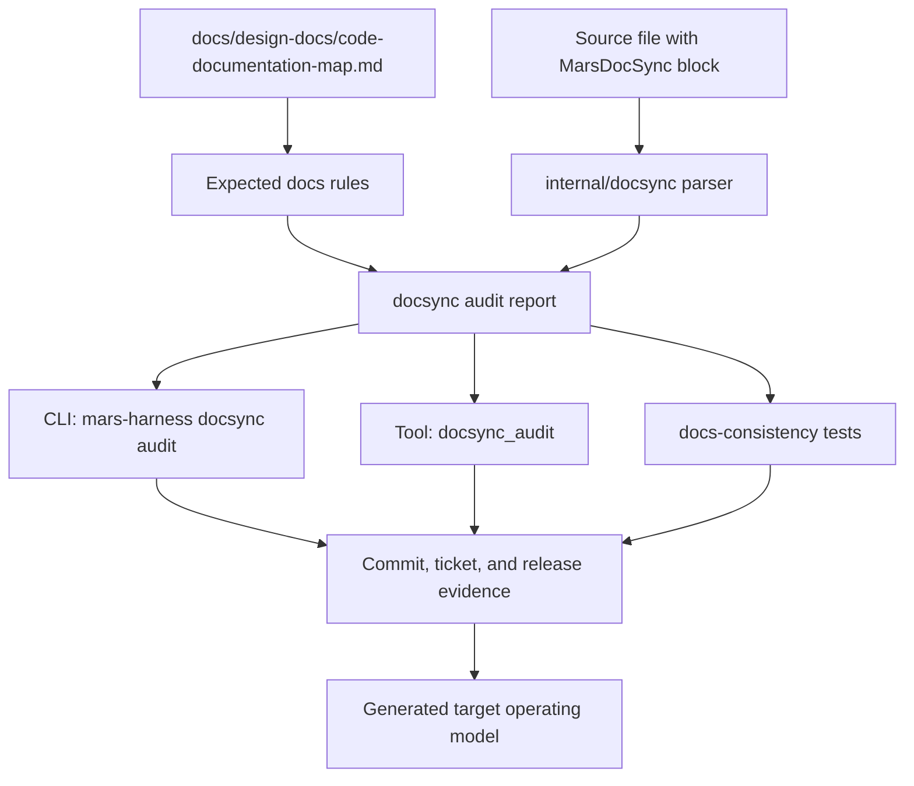

# AD-102: Documentation Sync Architecture And Universal Operating Model

**Status:** Accepted
**Date:** 2026-05-04
**Owner:** Mars Harness maintainers
**Related:** AD-098, AD-101, F-001
**Mirrors:** Generated target `docs/design-docs/documentation-sync-architecture.md`

## Context

Mars Harness treats the repository as the system of record. That only works if
source changes and durable documentation move together. Before the docsync
model, agents could update a package, role prompt, CLI command, or generated
target default and then leave future agents to infer which feature contracts,
design docs, product specs, release docs, role docs, or ticket guidance were now
stale.

The project already had two strong rules:

- Business logic is first-class BDD and belongs in `docs/features/`.
- No stale documentation means docs are updated as behavior changes.

The missing architecture was a reliable bridge between source files and the
docs that own them. A reviewer should not have to search the repo from scratch
for every changed file. An agent should not be allowed to say "docs checked"
without a repeatable checklist. Generated target harnesses need the same model,
because target repos inherit the operating doctrine and should not drift into a
weaker documentation discipline.

## Decision

Mars Harness uses **Documentation Sync** as a universal operating model for
source and generated target harnesses.

Every audited source file declares top-of-file `MarsDocSync` metadata with a
structured `docs:` list. The listed docs are the minimum documentation review
set whenever that file changes. The canonical source prefix map lives in
[code-documentation-map.md](code-documentation-map.md), while the mechanical
audit lives in `internal/docsync` and is exposed through:

```bash
mars-harness docsync audit --repo .
mars-harness tools run docsync_audit --repo . --args-json '{}'
```

The universal rule is:

> Before a code change is complete, read the changed file's `MarsDocSync` docs,
> update or verify those docs, then run docsync evidence.

The metadata is not just an index. It is a contract between code, architecture,
BDD, role behavior, generated target doctrine, release notes, and review.

## Goals

- Make source-to-documentation ownership explicit at file level.
- Make stale documentation mechanically detectable before commit.
- Give agents a repeatable operating model for doc review.
- Keep BDD feature contracts, architecture docs, generated target defaults, and
  release notes aligned with source changes.
- Mirror the model into initialized target repos so deployed harnesses inherit
  the same discipline.
- Keep the mechanism lightweight enough to run locally with no external
  services.

## Non-Goals

- The audit does not prove that documentation prose is semantically complete.
  It proves the metadata exists, references real docs, and includes required
  docs for the file's source prefix.
- The audit does not parse every programming language. It covers the source
  formats Mars Harness currently owns: Go, HTML, CSS, JavaScript, YAML, and
  GitHub workflow YAML.
- The audit does not replace human or agent judgment. It narrows the checklist
  so judgment is pointed at the right docs.
- The audit does not require every doc file to carry `MarsDocSync`; docs are the
  target artifacts, not audited source files.

## Architecture

Documentation Sync has six layers.



### 1. Metadata Layer

Each audited source file starts with a comment block near the top:

```go
/*
MarsDocSync:
docs:
- docs/design-docs/code-documentation-map.md
- docs/design-docs/documentation-sync-architecture.md
- docs/features/F-001-delivery-operating-model.md
*/
```

Language-specific rules:

- Go, CSS, and JavaScript use block comments.
- YAML and workflows use `#` line comments.
- HTML templates keep `<!DOCTYPE html>` first and place the metadata comment
  immediately after it.
- Go build tags and generated-file headers may stay first, but the
  `MarsDocSync` block must appear before package implementation declarations.

The metadata must list repo-relative docs. For a source file, "associated docs"
means the durable docs that describe or constrain the behavior in that file:
feature contracts, design docs, product specs, role docs, release docs, ticket
guidance, generated target guidance, or README surfaces.

### 2. Canonical Map Layer

The package-level map in [code-documentation-map.md](code-documentation-map.md)
sets the baseline docs expected for each source prefix. For example:

- `internal/agent/` maps to agent runtime architecture and F-005.
- `internal/release/` maps to release versioning and F-009.
- `internal/docsync/` maps to this architecture, the code map, the delivery
  operating model, and F-001.

The map is deliberately prefix-based. Most files in a package share the same
architecture and feature surface. Cross-boundary files add extra docs directly
in their metadata rather than forcing the whole package to carry unrelated
requirements.

### 3. Audit Engine Layer

`internal/docsync` is the deterministic audit engine. It:

- walks audited source roots;
- parses top-of-file `MarsDocSync` metadata;
- verifies each metadata doc path points to a durable documentation artifact;
- computes expected docs from the canonical prefix rules;
- reports missing metadata, missing docs, and missing required docs.

The report is intentionally simple:

- `Files`: audited files with declared docs and expected docs;
- `Findings`: path-scoped messages that can be fixed directly;
- summary text: `docsync: checked N files, findings M`.

The engine is pure local repository inspection. It does not call remote APIs,
read private telemetry, mutate files, or infer content from git history.

### 4. Command And Tool Layer

The CLI command is for humans, scripts, CI, and local development:

```bash
mars-harness docsync audit --repo .
mars-harness docsync audit --repo . --json
```

The mirrored tool is for harness agents:

```bash
mars-harness tools run docsync_audit --repo . --args-json '{}'
```

`docsync_audit` is non-mutating. It is exposed to roles that create, review, or
release code: Engineer, CTO, QA, Dogfood, Pipeline Fixer, Release Manager,
Security, Dependency Manager, and Janitor. The Orchestrator can route work
based on the resulting disposition, but does not need to mutate docs itself.

### 5. Test And Gate Layer

Docs-consistency tests make the operating model release-blocking:

- `internal/docsync` tests metadata parsing, expected-doc computation, missing
  metadata, and missing docs.
- `cmd/mars-harness` tests CLI flags and output.
- `internal/tools` tests the mirrored tool registration and report output.
- `internal/docsconsistency` runs the source-wide audit so missing metadata
  fails `go test ./...`.
- `internal/scanner` tests generated target doctrine, route docs, role
  allowlists, and generated feature scenarios.

### 6. Generated Target Layer

Initialized targets receive the same doctrine:

- `AGENTS.md` tells agents to read metadata, update docs, and run docsync.
- `docs/design-docs/code-documentation-map.md` defines the target's local map.
- `docs/design-docs/documentation-sync-architecture.md` explains the operating
  model.
- `docs/features/F-001-delivery-operating-model.md` includes the source-wide
  audit scenario.
- role allowlists include `docsync_audit` where documentation freshness must be
  checked.
- knowledge routes send implementation and docs-sync tasks to the right docs.

Generated targets may adapt their code map to their own architecture, but the
operating model remains inherited unless deliberately overridden by project
policy.

## Universal Operating Model

### Step 1: Identify Changed Source Files

Before editing, inspect the ticket or plan to understand scope. During and
after editing, use git status or the agent's changed-file list to identify
source files touched by the change.

The model applies to source code, templates, workflow definitions, generated
source defaults, and tool definitions. It also applies when an agent moves code,
splits packages, or renames files.

### Step 2: Read Each File's `MarsDocSync` Docs

For each changed source file:

1. Read the top-of-file `MarsDocSync` block.
2. Open the listed docs that match the behavior being changed.
3. If a listed doc is missing, obsolete, or too broad to be useful, update the
   metadata and the canonical map before completing the change.

Reading metadata is part of context assembly. It should happen before an agent
claims the implementation is complete.

### Step 3: Classify The Change

Classify the change by documentation impact:

| Change Type | Required Documentation Response |
| --- | --- |
| Business logic, user-visible behavior, state transition, validation, permission, routing, scoring, trust, release classification | Update the relevant `docs/features/F-NNN-*.md` contract step by step. |
| Architecture, package boundary, dependency, runtime lifecycle, persistence, tool policy, generated defaults | Update the associated design doc and index/decision log if needed. |
| CLI, dashboard, public command, role prompt, tool surface, target scaffold | Update product surface docs, tools glossary, role registry, generated defaults, or target docs. |
| Tests-only change that documents expected behavior | Check feature/design docs and update if the test reveals new product truth. |
| Mechanical formatting or metadata-only change | Run docsync and record that listed docs were checked when useful. |

When in doubt, update the doc. The cost of a small accurate doc update is lower
than the cost of a future agent rediscovering intent.

### Step 4: Update Docs Before Claiming Done

Documentation updates happen in the same change as the code. The owning doc is
the durable source of truth:

- BDD feature contracts own business behavior and acceptance scenarios.
- Design docs own architecture decisions, operating rules, and tradeoffs.
- Product specs own user-facing product promises.
- Tools glossary owns tool availability and tool selection.
- Role registry owns manifest role shape.
- Release notes own shipped impact, why, and what changed.

If the listed docs are already correct, the ticket, plan, review, or commit
evidence should say they were checked and remain current.

### Step 5: Add Or Repair Metadata

Add or update metadata when:

- creating a source file;
- moving a file to a new package;
- splitting behavior across packages;
- adding a new feature contract or design doc that owns the file;
- discovering that existing metadata points to stale or missing docs.

Metadata should include the package baseline from the code map plus any
cross-boundary docs the file directly implements.

### Step 6: Run Mechanical Evidence

Before commit, run:

```bash
mars-harness docsync audit --repo .
```

For agent runs, use:

```bash
mars-harness tools run docsync_audit --repo . --args-json '{}'
```

For source changes in this repo, run the docs-consistency test or full suite as
risk requires:

```bash
go test ./internal/docsync ./internal/docsconsistency
go test ./...
```

### Step 7: Record Evidence

Completion evidence should mention:

- the docsync command or test that passed;
- any docs updated;
- any docs checked and intentionally left unchanged;
- any remaining doc debt as a ticket or blocker.

Release notes should describe documentation-sync changes as product behavior
when they affect agents or operators, not as invisible internal churn.

## Role Responsibilities

| Role | Documentation Sync Responsibility |
| --- | --- |
| CEO | Ensures active plans name the feature contracts and docs that define the work before tickets are created. |
| CTO | Checks architecture docs, code map changes, tool-policy implications, and generated target mirroring. |
| COO | Creates tickets that reference BDD scenarios and docsync evidence expectations. |
| Engineer | Reads metadata before editing, updates associated docs with code, and runs docsync before commit. |
| QA | Verifies changed files include metadata, docs were updated or explicitly checked, and docsync passes. |
| Dogfood | Runs real harness paths and creates intervention debt when docsync or docs freshness fails repeatedly. |
| Release Manager | Ensures release notes explain documentation-sync impact, why, and what changed. |
| Janitor | Finds stale tickets, stale docs metadata, missing evidence, and outdated maps. |
| Orchestrator | Routes terminal dispositions to the next best role when docsync findings or stale-doc blockers appear. |

## Maintenance Workflows

### Adding A New Source Package

1. Add package files with top-of-file `MarsDocSync` metadata.
2. Add a prefix rule to `internal/docsync.Rules`.
3. Add the prefix to [code-documentation-map.md](code-documentation-map.md).
4. Update feature/design docs for the new behavior.
5. Run `mars-harness docsync audit --repo .`.
6. Run relevant package tests and docs-consistency tests.

### Moving Or Renaming Source Files

1. Check whether the target prefix has different expected docs.
2. Update moved file metadata to match the new owner docs.
3. Update cross-boundary notes in the code map if the file remains unusual.
4. Run docsync and package tests.

### Adding A New Feature Contract Or Design Doc

1. Add the doc.
2. Update metadata on files that implement the behavior described by the doc.
3. Update the code map only if the new doc becomes the baseline for a source
   prefix.
4. Update generated target defaults if the doc is universal doctrine.
5. Add docs-consistency or scanner assertions where the doc should be present.

### Deleting Or Replacing A Doc

1. Search for the doc path in `MarsDocSync` metadata.
2. Replace metadata references with the new owning doc.
3. Update `internal/docsync.Rules` and the code map.
4. Run docsync. It must fail before the repair and pass after it.

### Generated Target Adoption

Generated target docs are intentionally seed artifacts. When the source
operating model changes:

1. Update source design docs and feature contracts.
2. Update generated target docs in `internal/scanner/init.go`.
3. Update scanner tests to assert generated content.
4. Keep target adoption non-destructive: upgrades write missing defaults and
   report drift rather than overwriting user-owned docs.

## Invariants

- Every audited source file has a top-of-file `MarsDocSync` block.
- Every block uses structured `docs:` metadata.
- Every metadata path is repo-relative and points to an existing documentation
  artifact.
- Every audited file includes the docs required by the canonical prefix map.
- Cross-boundary ownership is explicit in file metadata.
- `mars-harness docsync audit --repo .` passes before code is claimed complete.
- Business behavior changes update BDD feature contracts before completion.
- Architecture or operating-model changes update design docs and generated
  target doctrine when universal.

## Failure Modes And Mitigations

| Failure Mode | Mitigation |
| --- | --- |
| Metadata exists but points to broad or irrelevant docs | Reviewers can require more specific docs; cross-boundary files list direct owning docs. |
| A new package has no map rule | Docs-consistency fails once files lack expected docs; adding a package includes updating `internal/docsync.Rules` and the code map. |
| Docs are checked mechanically but not updated semantically | BDD, QA, and release evidence still require human or agent judgment over the listed docs. |
| Generated targets inherit stale doctrine | Scanner tests assert target docs, role allowlists, feature scenarios, and knowledge routes. |
| File moves create stale metadata | Moving files requires docsync audit and map review in the same change. |
| The docs list becomes noisy | Keep prefix baselines narrow and add cross-boundary docs only where the file truly owns extra behavior. |

## Observability And Evidence

Documentation Sync is observable through:

- `docsync_audit` output in agent traces;
- CLI output in local command logs;
- docs-consistency failures in `go test ./...`;
- release notes for user-facing docsync capability changes;
- ticket evidence fields that cite docs updated or checked;
- generated target scanner tests that prove doctrine mirroring.

## Acceptance Criteria

- Source and generated target docs describe the architecture and operating
  model.
- `docsync audit` passes across audited source roots.
- Feature contracts include the source-wide docsync scenario.
- Roles that write or review code can run `docsync_audit`.
- The design-doc index records this decision.
- Future source-package changes have a clear maintenance workflow.

