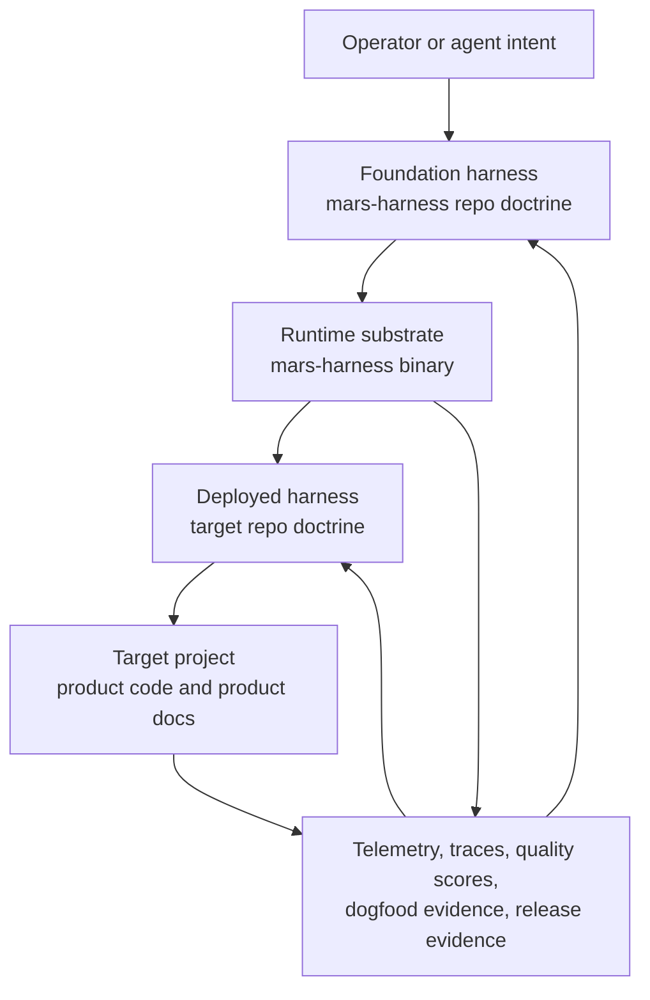

# AD-139: Foundation And Deployed Harness Architecture

**Status:** Accepted
**Date:** 2026-05-19
**Owner:** Mars Harness maintainers
**Related:** [harness-glossary.md](harness-glossary.md), [mirrored-harness-and-context-glossary.md](mirrored-harness-and-context-glossary.md), [delivery-operating-model.md](delivery-operating-model.md), [tools-glossary.md](tools-glossary.md), [skill-evolution.md](skill-evolution.md), [release-versioning.md](release-versioning.md)

## Context

Mars Harness has grown two closely related operating contexts:

- The **foundation harness** in this repository, which evolves `mars-harness`
  itself.
- The **deployed harness** generated into a **target project**, which helps
  agents build that target application.

The same executable binary participates in both contexts, but the binary is not
the whole harness. The `mars-harness` binary is the runtime substrate: it loads
manifests, manages the queue, runs roles, calls tools, records telemetry,
serves the dashboard, handles release/update workflows, and scaffolds deployed
harness defaults. The foundation harness is the repo-owned doctrine and product
system that tells agents how to evolve that runtime safely. A deployed harness
is the repo-owned doctrine inside a target project that tells agents how to
build the target while inheriting the reusable operating core.

This distinction became explicit during the 2026-05-19 recursive improvement
work. The live demo loop improved the running software factory, but it also
revealed a naming problem: source release mechanics, generated target doctrine,
tool/skill evolution, runtime telemetry, and target product work were being
discussed as if they were one layer. That blurs responsibility. When the layers
blur, runtime failures can become target backlog churn, source-only release
rules can leak into deployed projects, and agents have to infer whether a fix
belongs in code, a tool, a skill, a generated default, a design decision, or a
target ticket.

## Decision

Mars Harness treats the system as four coordinated surfaces:

| Surface | Definition | Primary artifacts | Owns | Does not own |
| --- | --- | --- | --- | --- |
| Foundation harness | The harness consumed by agents operating in this source repo. | `AGENTS.md`, `docs/design-docs/`, `docs/features/`, `docs/exec-plans/`, `docs/tickets/`, `.harness/`, role registry, release docs. | Product direction for `mars-harness`, source operating model, source release discipline, generated default doctrine, tool/skill evolution policy, source dogfood evidence. | Direct product code in target projects during a target run. |
| Runtime substrate | The compiled `mars-harness` binary and its internal packages. | `cmd/mars-harness`, `internal/*`, SQLite databases, dashboard, CLI, tools, MCP server, scanner, release/update code. | Deterministic execution, orchestration, persistence, guardrails, tool execution, generated scaffolds, telemetry capture, operator interfaces. | Deciding doctrine by itself; self-modifying source code during an active target run. |
| Deployed harness | The harness consumed by agents inside a target project generated or upgraded by `mars-harness`. | Target `AGENTS.md`, target `.harness/`, target `docs/design-docs/`, target `docs/features/`, target `docs/tickets/`, target release docs. | Target operating model, target product planning, target feature contracts, target tickets, target quality evidence, target-specific skills. | Source binary release assets, foundation repo release tags, or foundation implementation internals. |
| Target project | The application repository being built. | Product source, tests, package files, target docs, target git history. | Product behavior, product-specific architecture, product release value, target-owned feedback and bugs. | Foundation runtime defects or source doctrine decisions except through mirrored rules. |

The shared center is the **mirrored operating-model core**: the reusable rules
that should exist in both foundation and deployed harnesses unless explicitly
marked source-only. It includes goals, BDD feature contracts, active plans,
ticket lifecycle, evidence discipline, no stale documentation, context routing,
trust/autonomy behavior, self-improvement routing, tool/skill selection
principles, and strict repo-owned workflow records.

Source-only rules must say they are source-only. Target-only rules must remain
inside the target repo. Ambiguous operating rules default to mirrored doctrine,
following AD-058, but mirroring should carry the reusable principle rather than
foundation implementation detail.

## Architecture View

The runtime can execute foundation workflows and deployed workflows, but it does
not erase the boundary between them. Foundation agents can change this repo and
then publish a new binary or generated default. Deployed agents work inside a
target project using the generated harness and tools available for that target.
The harness is never the target of its own agents during active target runs.

## Doctrine Flow

| Step | Foundation action | Runtime action | Deployed impact |
| --- | --- | --- | --- |
| 1. Decide doctrine | Record or update design docs, feature contracts, active plan, tickets, glossary, role registry, or skill/tool docs. | None unless code or generated defaults change. | No effect until doctrine is mirrored or a target upgrade/fresh init adopts it. |
| 2. Implement deterministic support | Change CLI, scanner, queue, tools, guardrails, docsync, release, dashboard, telemetry, or agent runtime packages. | Compiled binary carries the new behavior. | Deployed harnesses receive behavior when run by that binary. |
| 3. Mirror reusable doctrine | Update generated target guidance in scanner defaults and tests. | `init` and `upgrade` expose the reusable doctrine to target repos. | New targets inherit it; existing targets adopt missing defaults deliberately. |
| 4. Keep source-only mechanics out | Mark source release assets, foundation dogfood shorthands, and source repo maintenance as source-only. | Runtime may still provide commands, but target guidance does not claim source release obligations as product requirements. | Target repos inherit target-appropriate release discipline, not foundation binary publication mechanics. |
| 5. Review drift | Run docsconsistency, docsync, scanner, and live demo checks where applicable. | Deterministic checks expose mismatches. | Drift becomes a source ticket, generated-default ticket, or target-owned ticket depending on ownership. |

## Boundary Matrix

| Behavior | Foundation-only | Mirrored core | Deployed-only |
| --- | --- | --- | --- |
| Publishing `mars-harness` binary assets | Yes. Source local release publication tags `vX.Y.Z`, builds local binary assets, writes checksums, and may optionally mirror to GitHub Releases. | No. | No, unless a target separately chooses an equivalent binary release model. |
| Versioned target release notes | No. | Yes. Targets inherit release notes and changelog discipline appropriate to their repo. | Target-specific versioning policy can extend or override locally. |
| Live `demo-123` replay | Yes as the canonical source first-run lifecycle replay. | The run-review-act-rerun evidence loop mirrors generically. | A target can define its own representative demo or E2E replay. |
| BDD feature contracts | No. | Yes. Feature contracts define product behavior before or alongside implementation. | Target contracts describe target product behavior. |
| Tool creation governance | No. | Yes when creating built-in or mirrored tools. | Target-specific tools may be added when local policy allows. |
| Skills | Foundation skills are source-only when they operate the software factory. | Universal skills mirror when they encode reusable operating doctrine. | Deployed skills capture target-specific reusable procedures. |
| Runtime telemetry | Foundation telemetry owns runtime defects, orchestration defects, model/provider issues, tool policy failures, and source dogfood findings. | Feedback routing and evidence discipline mirror. | Target telemetry owns target product findings and local operating gaps. |
| Intervention debt | Source/runtime failures stay foundation telemetry or source tickets by default. | Only target-owned causes become target backlog work. | Target intervention debt covers stale target work, target follow-up, reverted target commits, and product behavior findings. |
| Generated default guidance | Yes, source owns the templates and tests. | Reusable rules mirror into generated targets. | Existing target files remain user-owned after init. |

## Feedback Collection And Routing

Feedback is collected through durable evidence surfaces, not chat memory alone.
The receiving layer is determined by root cause.

| Feedback source | Examples | First durable record | Owning route |
| --- | --- | --- | --- |
| Source dogfood run | `demo-123` lifecycle replay, first-run product progress, intervention-debt count, runtime artifact paths. | Dogfood evidence note, active plan evidence, design doc discovery, or source ticket. | Foundation harness unless the finding is clearly target product behavior. |
| Runtime telemetry | Tool timeout, context overflow, guardrail block, dispatch protocol failure, model/provider error, queue loop. | SQLite telemetry, trace, quality score, source ticket when actionable. | Foundation harness and runtime substrate. |
| Target product evidence | Broken game behavior, missing UI state, failed product acceptance scenario. | Target feature evidence, target ticket, target design doc. | Deployed harness and target project. |
| Release evidence | Changelog generation, tag push, GitHub Release object, missing binary assets. | Foundation release docs, active plan blocker, release ticket. | Foundation-only for `mars-harness` binary publication. |
| Human review | Operator says a loop, term, or workflow is confusing or repeated. | Owning design doc, glossary route, feature contract, or ticket. | Foundation if it changes harness doctrine; deployed if it is target-local. |
| Quality score | Low score, recurring failure bucket, stale evidence. | `docs/QUALITY_SCORE.md`, score export, source or target ticket only when ownership is clear. | Quarantined to the owning repo; target backlog materialization is explicit or target-owned. |

Routing rules:

- Foundation/runtime failures default to foundation telemetry or source tickets.
- Target backlog intervention debt is allowed only when the root cause is
  target-owned or the operator explicitly asks to materialize it.
- A generated-target guidance gap is a foundation source ticket first, because
  the scanner defaults and mirroring tests live in this repo.
- A target project may record a local override, but source doctrine must not
  silently rewrite user-owned target files.

## Tool, Skill, And Binary Relationship

The runtime substrate contains executable tools and CLI commands. Skills teach
agents how to perform recurring workflows. The foundation harness decides when
a process should become a tool, a skill, a guardrail, a knowledge route, or a
ticket. These are deliberately different authority levels:

| Surface | Grants authority? | Best for | Example |
| --- | --- | --- | --- |
| Runtime tool | Yes, within trust and guardrail policy. | Deterministic actions that need validation or consistent state mutation. | `ticket_create`, `docsync_audit`, `mars_harness_cli`, release/status/audit tools. |
| Skill | No. It guides behavior but does not grant tool access. | Reusable judgment, sequencing, review checklists, and stop conditions. | A release-publication workflow skill, if later accepted by T-005. |
| Design doctrine | No direct execution. | Durable rationale and system boundaries. | This document, AD-138, AD-139. |
| Generated target default | Indirectly, through target context. | Reusable operating rules that target agents should inherit. | BDD, ticket lifecycle, documentation discipline, generic live evidence loop. |

The meta-tool chain can use the foundational orchestrator to improve the
orchestrator's own source repo, but only as foundation work with normal repo
controls: active plan, feature contract, ticket, bounded source change, tests,
release notes, remote push, release publication, and evidence. It is not
uncontrolled self-modification. During a run against a target project, the
harness must not treat itself as the target of its own agents.

This leaves a clean path for future work:

1. Identify repeated evidence.
2. Route it to the owning layer.
3. Decide whether the fix is doctrine, skill, tool, guardrail, runtime code,
   generated target guidance, or target product work.
4. Implement the smallest bounded change.
5. Mirror only the reusable core.
6. Recheck the live or deterministic evidence that justified the change.

## Failure Ownership Classification

Every live-loop finding is classified before it becomes backlog or code. The
classification is an operating-model step, not a retrospective label:

| Class | Root cause | Fix level | Backlog route |
| --- | --- | --- | --- |
| Foundation-owned | Runtime substrate, generated defaults, role guidance, tool policy, orchestration, model/provider behavior, telemetry, release/update, source-only release mechanics, or mirrored doctrine. | Patch `mars-harness` source, generated target defaults, foundation docs, role prompts, tools, skills, or tests so all applicable users benefit. | Source ticket, source plan, design-doc discovery, or foundation telemetry; not target product backlog by default. |
| Deployed-owned | Target product behavior, target architecture, local package/build/test setup, target docs, target-specific skills, or project policy. | Patch the target repo or deployed harness artifact and preserve target evidence. | Target product/enabler/intervention ticket owned by that target repo. |
| Mixed or unclear | A target symptom exposes a possible foundation gap, or a foundation limitation blocks a target product path. | Apply the smallest local unblock only when needed to finish target evidence, then create a foundation follow-up for the reusable defect. | Both routes may exist, but each ticket states which layer it owns and what evidence proves it. |

Ambiguous failures default to observation, telemetry, or an investigation note
until ownership is clear. They must not automatically become target
intervention-debt tickets. Batch fixes by ownership and generality: a
foundation fix should benefit a class of projects or all users, while a
deployed fix should improve the specific target product or its local harness.
This prevents the software factory from overfitting to one demo stack while
still allowing target projects to finish.

## Doctrine Maintenance

Doctrine maintenance is an operating duty, not a one-time documentation task.
When the system evolves, maintainers and agents must update the owning doctrine
surface in the same slice:

| Change type | Owning doctrine | Required maintenance |
| --- | --- | --- |
| Source runtime behavior | Design doc, BDD feature contract, code `MarsDocSync` docs, tests. | Update docs before or alongside code; run docsync/docsconsistency. |
| Operating rule | Design doc, `AGENTS.md` when first-class, generated target defaults unless source-only. | State whether the rule is foundation-only, mirrored, or deployed-only. |
| CLI workflow | CLI reference, `mars_harness_cli`, repo shortcut map, generated target guidance, affected skills. | Run CLI sync checks named by the CLI tool/skill sync doc. |
| Tool policy | Tools glossary, role registry, trust policy, generated tool guidance where mirrored. | Use `tool_create` for new built-in tools unless a recorded exception exists. |
| Skill workflow | Skill file, skill-evolution doc if doctrine changes, generated target skill guidance when universal. | Keep skills compact and evidence-oriented. |
| Feedback routing | Self-reflective telemetry, delivery operating model, active plan, tickets. | Keep runtime failures out of target backlog unless target-owned or operator-invoked. |
| Release behavior | Release-versioning doc, release manager guidance, changelog/version artifacts. | Keep source binary asset rules distinct from target release-note discipline. |

Doctrine drift is detected through four channels:

- deterministic checks such as docsconsistency, docsync, scanner, CLI sync, and
  release verification;
- live target checks such as the `demo-123` source replay or a target-specific
  E2E replay;
- telemetry and quality-score trends;
- human review that identifies repeated confusion, missing terms, or duplicated
  sources of truth.

When drift is found, the correction should be ticket-backed unless the change is
small, local, and already inside the active slice. The ticket should identify
which layer owns the issue and whether generated target mirroring is required.

## Generated Target Implications

This document is source foundation doctrine. Its reusable core should be
mirrored into generated targets in a follow-up slice:

- targets need the terms foundation harness, deployed harness, target project,
  operating model, mirrored harness definitions, mirrored tools, universal tool
  surface, universal skills, foundation skills, and deployed skills;
- targets need a route that tells agents where to read the foundation/deployed
  boundary when changing operating doctrine;
- targets need the generic feedback loop: collect evidence, route ownership,
  update doctrine or product artifacts, and avoid target backlog noise for
  foundation-owned runtime failures;
- targets do not need source-only `demo-123` shorthand, source release asset
  verification, or foundation repo binary publication mechanics.

Existing target repos remain user-owned. `upgrade` should fill missing defaults
without overwriting deliberate local policy.

## Drift Review Evidence

### 2026-05-19 Doctrine Review

T-004 reviewed the foundation and generated target doctrine surfaces after
AD-139 and the generated route landed.

| Surface | Result | Evidence |
| --- | --- | --- |
| Source `AGENTS.md` | Consistent. It keeps first-class foundation/deployed glossary terms, marks target projects as separate from the software factory, and states that agents never make the harness the target of its own active target runs. | `rg` inspection of glossary, target-project, release, and live-demo loop entries. |
| Source harness glossary | Consistent. It now routes foundation/deployed boundary changes to this document instead of bloating first-class glossary text. | `docs/design-docs/harness-glossary.md` contextual route. |
| Source mirrored-harness doctrine | Consistent. It includes an AD-139 summary separating foundation ownership, runtime substrate, deployed ownership, target product evidence, mirrored core doctrine, and source-only mechanics. | `docs/design-docs/mirrored-harness-and-context-glossary.md`. |
| Tools glossary | Consistent. It keeps the universal tool surface model-provider-agnostic and describes tools as mirrored capabilities without claiming that skills grant tool authority. | `docs/design-docs/tools-glossary.md`. |
| Release doctrine | Consistent with one explicit boundary. Source `release-versioning.md` contains `mars-harness` binary asset and `checksums.txt` details for local source release publication; generated target release guidance keeps GitHub Release mirrors optional for repositories that publish their own assets. | `docs/design-docs/release-versioning.md`, `internal/scanner/init.go`. |
| Generated target knowledge route | Consistent. New targets receive a route for foundation/deployed architecture, mirrored operating doctrine, recursive improvement boundaries, doctrine drift, source-only rules, deployed-only rules, runtime feedback routing, and tool/skill authority. | `internal/scanner/init.go`; `go test ./internal/scanner -run TestInit_success`. |
| Generated target harness glossary | Consistent. New targets receive a contextual route to the mirrored harness doc rather than a full copy of the source architecture doc. | `internal/scanner/init.go`; scanner assertions. |
| Generated mirrored-harness doc | Consistent. New targets receive the reusable AD-139 core and explicitly keep `demo-123` and `mars-harness` binary release asset publication foundation-only unless a target adopts an equivalent local policy. | `internal/scanner/init.go`; scanner assertions. |
| Generated target tests | Consistent. Scanner coverage checks the new route, AD-139 mirror, design-index entry, and absence of source binary asset names such as `mars-harness-linux-amd64`. | `internal/scanner/scanner_test.go`. |

No unowned doctrine mismatch was found in this review. The remaining open item
is T-005: decide whether the recursive improvement loop should become a
universal skill, a foundation skill, a deployed skill pattern, or remain design
doctrine.

## Consequences

- Agents get stable language for the split between source doctrine, executable
  runtime, generated doctrine, and target product work.
- Runtime failures have a home that is not the target product backlog by
  default.
- Tool and skill decisions can be made by authority level instead of by taste.
- Recursive improvement remains bounded foundation work with tests, tickets,
  release evidence, and remote publication.
- Generated target guidance can inherit the reusable operating model without
  inheriting foundation-only binary release mechanics.

## Open Follow-Ups

- T-003 mirrors the reusable route and core doctrine into generated target
  guidance.
- T-004 verifies drift across foundation docs, generated target docs, release
  guidance, glossary, tools, and operating model surfaces.
- T-005 decides whether the recursive improvement loop should become a
  universal skill, foundation skill, deployed skill pattern, or remain design
  doctrine.
