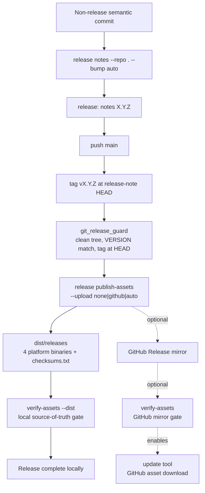

# Release Versioning And Patch Notes

**Status:** Accepted
**Date:** 2026-05-02

## Context

MARS had a build-time `version` command and release-manager prompt, but no repo-owned semantic version, no committed patch notes, and no deterministic way for the harness or a target repo to produce them. That made release state live in ad hoc human memory.

The behavior also needs to mirror into initialized target repositories. If the source harness expects semantic versioning and generated patch notes, target harnesses should receive the same version files, release guidance, and release-manager workflow.

## Decisions

### AD-049: VERSION Is The Semantic Version Source

MARS and initialized target repos use a root `VERSION` file containing `MAJOR.MINOR.PATCH`. Release builds may still inject build metadata with linker flags, but the repo-owned version is what agents and release tooling update.

### AD-050: CHANGELOG.md Is Generated Patch Notes

Patch notes live in root `CHANGELOG.md`. Entries are generated from semantic commits using `mars release notes`. Each generated entry includes a release marker with the version and source commit so the next run can find only new commits even when no git tag exists yet.

Generated entries start with plain-English narrative before the commit buckets.
The narrative must include `Impact`, `Why`, and `What Changed` sections so the
changelog explains the operator-facing effect of the release, why the change
was worth shipping, and what concrete behavior or documentation changed. The
semantic commit buckets remain as an audit index, not the only release text.

### AD-099: Release Notes Explain Impact, Why, And What

Release notes are product communication, not only a commit digest. Each
generated release entry must provide complete user-facing text for:

- `Impact`: who or what is affected, including operator, agent, maintainer,
  target-repo, compatibility, reliability, or evidence impact.
- `Why`: the reason the change matters, the failure mode or capability gap it
  closes, or the operating-model value it preserves.
- `What Changed`: the concrete change that landed, with commit references for
  traceability.

Commit bodies may include `Impact:`, `Why:`, and `What:` lines for richer
release text. When those fields are absent, the generator produces conservative
fallback prose from semantic commit type, scope, and message. Structural
delivery changes use stronger topic-aware fallback profiles, so operating-model,
structured dispatch, persona, documentation-sync, and CLI/tool-sync releases
explain the workflow shift instead of repeating a thin commit subject.

### AD-100: Historical Release Notes Are Backfilled Through The Release Tool

Release-note standards apply to the whole changelog, not only the newest entry.
When the narrative standard changes, maintainers use `mars release
backfill-notes` to rewrite existing marker-backed entries from their historical
commit ranges. The command treats each `mars-release` marker as the
authoritative release boundary, ignores `release:` commits, preserves existing
semantic buckets and delivery evidence, and replaces legacy narrative sections
with generated `Impact`, `Why`, and `What Changed` prose. If old git topology is
non-linear, the tool falls back to the commit hashes already present in that
entry's semantic buckets.

Backfill fills missing or legacy narrative; it must not downgrade entries that
already contain complete current `Impact`, `Why`, and `What Changed` sections.
Those entries may be richer than the commit-subject fallback the tool would
generate today, so the checker treats them as compliant release history.

The command supports `--dry-run` for review, `--check` for docs-consistency and
CI gates, and `--min-version` / `--max-version` for bounded historical batches.
If a marker commit is missing or no non-release commits can be found for an
entry, the command fails with an actionable error instead of inventing release
history.

### AD-051: Source And Target Release Behavior Mirrors

`mars init` creates `VERSION`, `CHANGELOG.md`, release-versioning design guidance, and release knowledge routes in target repos. The default release-manager prompt uses the same `release notes --repo . --bump auto` command that MARS itself uses, but executes MARS commands through the structured `mars_cli` tool rather than `shell_exec mars ...` so deployed agents resolve the active harness executable before any stale installed PATH binary.

### AD-056: Source Changes Are Automatically Versioned On Commit

Every non-release semantic commit to this source repository must be followed by an automatic release-note generation step before the task is considered done:

1. commit the coherent source/doc/test change
2. run `mars_cli` with args `["release","notes","--repo",".","--bump","auto"]`
3. verify the generated `VERSION`, `CHANGELOG.md`, and `internal/buildinfo/version.go` changes
4. run `mars_cli` with args `["release","backfill-notes","--repo",".","--check"]`; if it reports
   legacy entries, run `mars_cli` with args `["release","backfill-notes","--repo","."]` and
   include that changelog correction in the same release-note commit
5. commit them as `release: notes X.Y.Z`
6. push `main`

For operator terminal work, the equivalent command is
`mars release notes --repo . --bump auto`; in agent jobs the
structured `mars_cli` form is required to avoid stale PATH binaries.

The `release: notes X.Y.Z` commit itself is exempt. The release generator ignores release-note commits so the workflow does not create an infinite version loop.

### AD-057: Target Harnesses Inherit Automatic Versioning

Initialized target repositories use the same operating rule. `mars init` writes target `AGENTS.md`, `docs/design-docs/release-versioning.md`, and the release-manager prompt so every non-release semantic commit in the target repo is followed by:

1. `mars_cli` with args `["release","notes","--repo",".","--bump","auto"]`
2. verification of generated `VERSION` and `CHANGELOG.md`
3. `mars_cli` with args `["release","backfill-notes","--repo",".","--check"]`, with any required
   historical backfill included before commit
4. a `release: notes X.Y.Z` commit
5. push to `main`

Target repos do not have `internal/buildinfo/version.go` unless their own project defines one. The mirrored rule is the workflow contract, not a requirement for target repos to copy MARS internals.

Dispatch-mode target lifecycles do not leave this rule to the weekly release
schedule alone. When Dogfood approves or completes validation after product
work, deterministic dispatch routes to `release-manager` when that role exists,
so versioning and release blockers become part of the same autonomous product
delivery chain.

### AD-059: Versioned Releases Are Published From Local Assets

> **Superseded 2026-07-21 by AD-313/T-065/F-018.** The bespoke publisher
> described below is no longer reachable. The original contract is retained as
> historical evidence.

A release is not fully complete until local release assets are built and
verified. GitHub Releases remain an optional mirror when the repository has
authenticated GitHub release capability.

After a `release: notes X.Y.Z` commit is pushed to `main`, release work must:

1. create or update tag `vX.Y.Z` at the release-note commit
2. run `mars release publish-assets --repo . --version vX.Y.Z
   --upload none|github|auto`
3. verify local release assets with `mars release verify-assets --dist
   dist/releases --version vX.Y.Z`
4. when GitHub mirroring is configured, verify the release object exists with
   `gh release view vX.Y.Z`
5. verify mirrored GitHub assets with `mars release verify-assets
   --version vX.Y.Z` before claiming installer or self-update availability from
   the mirror

Release publication has two independent gates:

- **Local asset gate:** `mars release verify-assets --dist
  dist/releases --version vX.Y.Z` must pass before a source release is complete.
- **Optional GitHub mirror gate:** `gh release view vX.Y.Z` and
  `mars release verify-assets --version vX.Y.Z` must pass before the
  GitHub mirror is advertised as installable.

GitHub remains optional infrastructure. If the repo has no GitHub remote, no authenticated release credentials, or the GitHub API fails, the release manager records the mirror blocker without treating local asset publication as failed.

### AD-313: Source MARS Uses Pinned GoReleaser; Targets Own Their Producer

MARS source builds publication-disabled private snapshots with the exact
GoReleaser, Syft, and Go pins declared by T-065 and `.goreleaser.yaml`. The
default producer has no tag, upload, signing, announcement, or publication
authority. T-066 owns archive consumers and signature verification, T-067 owns
the source-only Go 1.25.12 compatibility floor, T-068 owns private rehearsal,
and F-017/F-018 cutover approval is required before a supported release exists.
Generated target repositories do not inherit this Go-specific producer or
source floor; each target chooses and documents its own release workflow and
artifact contract.

> **Launch-transition addendum — 2026-08-08.** T-071 through T-079,
> including resumed T-058 corrections, retain `VERSION=0.68.49` and source
> fallback `0.69.0-dev`; their validated checkpoints are pushed without
> release notes, tags, signatures, upload, publication, or announcement.
> T-080 alone ends the freeze by publishing signed `v0.69.0` as the rollback
> bridge and signed `v0.69.1` as latest. Evidence-only T-081 settings/canary
> closeout retains `v0.69.1`; a product, runtime, security, or public-contract
> correction found during canary requires immutable `v0.69.2` and repetition
> of the anonymous lifecycle and 48-hour canary.

T-066 supplies the matching signed archive consumer: release-mode update
authenticates the exact checksum bytes, release workflow identity, tag and full
commit, platform/build metadata, archive digest and bounded structure before a
durable replace-or-restore transaction. The former standalone verification and
audit commands are retired rather than retained as weaker parallel consumers.

### AD-312: Attempted GitHub Mirrors Must Converge Before Success

> **Implementation superseded 2026-07-21 by AD-313/T-065/F-018.** T-065
> removes the bespoke uploader described below. Exact post-upload convergence
> remains a required invariant for the future F-018-S004 cutover path.

`release publish-assets --upload github` and an `--upload auto` invocation that
has begun a GitHub upload may report success only after a fresh remote snapshot
matches the local release contract. A successful `gh` process exit is transport
evidence, not the publication postcondition.

The publisher computes the immutable local contract as the nine unique
basenames, byte sizes, and SHA-256 digests, copies them into an owner-only
snapshot, and revalidates snapshot identity and bytes around transfer. It
requires the remote tag to peel to the exact local release-note commit before
mutation and again before success; a release object is created only after an
exact not-found response and with `--verify-tag`. GitHub CLI status
classification trusts only its bounded synthesized stderr status line; the
server-controlled stdout response body cannot grant release-creation authority.
It preserves matching remote assets,
reconciles missing or mismatched assets individually in deterministic order,
uses `--clobber` only for a mismatched name, and polls with bounded,
context-aware retries. Completion requires the exact tag and exact unique asset
set, no extras, every asset state `uploaded`, and exact size and digest equality.
Missing digests, duplicates, extras, pending states, wrong bytes, permanent
partial convergence, cancellation, or retry exhaustion return non-zero as a
mirror-incomplete blocker. The command never deletes unexpected remote assets
automatically and never moves the tag.

`--upload auto` may still report a pre-attempt skip when `gh` is unavailable.
After an upload attempt begins, optional infrastructure does not permit a false
success: the local release can remain valid while the GitHub mirror is recorded
as blocked.

#### Release Publication Architecture



The local dist gate is mandatory. The GitHub mirror branch is optional and only
controls whether installer and self-update claims can rely on GitHub-hosted
assets.

### AD-141: Foundation Release Publication Uses A Source-Only Skill

> **Superseded 2026-07-21 by AD-313/T-065/F-018.** The skill remains
> source-only but now governs publication-disabled GoReleaser/Syft snapshots;
> the original publisher sequence below is retained as historical evidence.

The source harness release path has a repeated judgment-heavy sequence after
each non-release semantic commit: generate release notes, commit and push them,
tag the release, publish local assets, optionally mirror to GitHub Releases,
verify binary assets, and record missing-asset blockers without pretending a
notes-only release is complete.

The deterministic commands remain `mars release notes`, git,
`mars release publish-assets`, optional GitHub CLI mirroring, and
`mars release verify-assets`. The reusable procedure lives in
`.harness/skills/release-publication/SKILL.md` so Release Manager and Codex
share the same ordered checklist and stop conditions.

This skill is foundation-only for now. Generated targets keep the mirrored
release docs and Release Manager prompt, but they do not receive the source
skill because their publication surface may be different from MARS
binary releases. A generic target release skill can be added later when target
publication modes have a stable contract.

### AD-068: The Installed Command Can Update Itself

> **Packaged-path amendment 2026-07-22 by AD-313/T-066/F-018.** Release-mode
> update now accepts only the canonical signed archive contract and verifies
> its offline Sigstore evidence, immutable tag/full commit, platform/build
> metadata, checksum, digest, and bounded archive structure before durable
> replacement. The raw asset/checksum-only packaged path below is retained as
> historical evidence and is unsupported. Source checkout install/update is the
> current supported route until an approved cutover publishes signed archives.

Operators should not need to `cd` into the source repository to upgrade the built binary. The installed `mars` command owns its own update surface through `mars update tool`.

The primary path for anyone cloning this repo is source checkout installation:
`make install` installs the current checkout, while `make update-tool` safely
fast-forwards a clean clone from `origin/main`, reinstalls with `go install`,
refreshes shell PATH setup, and prints the installed version.

The packaged-user path remains available for binary release assets. It downloads
the matching `mars-{os}-{arch}` asset, verifies `checksums.txt`, and
atomically replaces the binary in the directory containing the currently running
command. This avoids requiring Go or a source checkout for packaged users.

Official release metadata is anonymous-first. `mars auth github check` makes
one exact, no-redirect anonymous request to the official `api.github.com`
release-metadata endpoint. Only an exact `401`, `403`, or `404` may trigger
credential resolution and one authenticated retry to the same origin and path;
transport failures, redirects, unexpected statuses, and custom origins never
receive credentials. The check classifies access as `anonymous`,
`authenticated`, or `unavailable` without credential-derived output.

Private forks and rate-limit fallback retain the optional binary-release auth
model. Operators may run `mars auth github setup`; verified GitHub CLI or
explicit token auth may be stored as an owner-only local fallback under
`~/.mars/`. `mars auth github clear-local` idempotently removes only the stored
config `github_token`, preserving all other fields and leaving environment
variables, GitHub CLI and GitHub App credentials, repositories, and remote state
unchanged. Token values are never printed, written to target repos, or included
in traces, telemetry, doctor output, JSON, errors, tickets, or docs.

When release metadata exposes GitHub asset API URLs, the updater downloads from
those authenticated API URLs instead of browser download URLs so private assets
do not fail behind a misleading 404. Missing or invalid auth points to
`mars auth github setup`; headless installs may use `GH_TOKEN`,
`GITHUB_TOKEN`, or `mars auth github setup --token <token>`.

Source checkout and packaged-user onboarding both run ordinary `mars setup`
without a private-release-auth step or GitHub credential requirement.
`--skip-github` remains scoped to optional GitHub integration setup.
`mars doctor` reports anonymous, authenticated, or unavailable release access
with a concrete fix, and agents can use the read-only `github_auth_check` tool before binary
update, release verification, install repair, or version-drift remediation.

Source-development updates remain available through `mars update tool
--source` or `mars update tool --version main`. That path uses `go
install github.com/greaveselliott/mars/cmd/mars@<version>` with
`GOBIN` set to the install directory.

### AD-069: Update Is The Unified Verb For Tool And Deployed Harness Changes

The CLI should use the same language when the goal is the same. "Update" means bring an installed or deployed harness surface up to the current expected version:

- `mars update tool` updates the installed CLI binary.
- `mars update harness --repo <path>` updates the `.harness/` bundle deployed into a target repo.
- `mars upgrade --repo <path>` remains as a compatibility alias for target harness updates while docs migrate to `update harness`.

### AD-070: Update Check Detects Tool And Target Harness Drift

`mars update check --repo <path>` compares both update surfaces before mutating anything:

- the installed CLI version against the latest GitHub release, or another GitHub-compatible latest-release endpoint supplied by the operator
- the target repo's generated `.harness/metadata.yaml` generator version against the installed CLI version

The command emits machine-readable JSON with `--json` and recommends `update tool`, `update harness`, or both. Remote lookup failures are reported as `unknown` for the tool and do not prevent local target-harness checks. `mars doctor --repo <path>` includes the same drift signal as a warning so operators see stale binary or target harness state during health checks.

`mars init` and `mars update harness` write `.harness/metadata.yaml`. This file is generated state owned by the harness updater, unlike role prompts, manifests, guardrails, knowledge routes, tickets, and docs, which remain user-owned after init.

### AD-075: Install And Update Configure User Shell PATH

Operators should not need shell-specific setup knowledge to run the installed
command. Source `make install`, `mars setup`, and `mars update
tool` converge on the same shell-path configurator. It detects Fish, Zsh, Bash,
POSIX sh/Ksh, Csh, and Tcsh; writes an idempotent user-profile snippet; and
reports unsupported shells with the install directory to add manually.

The explicit command is:

```bash
mars path setup --install-dir <dir>
```

`make install` runs that command through the freshly installed binary using its
absolute path, so the first source install fixes Fish/Zsh/Bash/POSIX PATH for
future terminals. `make update-tool` is the source-checkout update path for repo
cloners: it refuses dirty, missing-origin, and diverged checkouts, fast-forwards
clean clones from `origin/main`, installs through `go install`, repeats PATH
setup, and prints the installed version. `update tool` repeats the same setup
after reinstalling the binary. `setup` includes the same step so binary-release
installers can call one setup flow later.

The command cannot mutate the already-running parent shell process after it
exits. It prints a reload hint for the current session and makes new terminals
work without manual profile editing.

### AD-078: Release Assets Are Built From Tags And Verified

> **Superseded 2026-07-21 by AD-313/T-065/F-018.** The bespoke producer below
> is no longer reachable. T-066 owns migration of the retained consumers.

For the source harness, `mars release publish-assets --repo . --version
vX.Y.Z --upload none|github|auto` is the authoritative asset-publication path
after the release-note commit is on `main` and tag `vX.Y.Z` points at that
commit. The command cross-compiles `linux/darwin` x `amd64/arm64`, writes
`checksums.txt`, verifies local release assets, and can optionally create or
update a GitHub Release mirror from the matching `CHANGELOG.md` entry. Release
managers must run `mars release verify-assets --dist dist/releases
--version vX.Y.Z` before claiming the local installer or self-update path is
shipped. When GitHub mirroring is used, they also run `mars release
verify-assets --version vX.Y.Z` before advertising the mirror.

### AD-207: Release Tags Must Point At The Release-Note Commit

The `demo-temp-run53` replay proved the generated target lifecycle can now
reach local release notes, but Release Manager briefly tagged `v0.2.0` at the
pre-release-note Dogfood commit while `VERSION` and `CHANGELOG.md` were still
dirty. The disposition guard forced the release-note commit afterward, but the
local tag still pointed at the wrong commit.

Release tags are therefore a mechanical invariant, not a prompt-only ritual.
Before any `git tag vX.Y.Z` shell command is allowed, the worktree must be
clean, `VERSION` must equal `X.Y.Z`, `HEAD` must be the
`release: notes X.Y.Z` commit, and any explicit tag target must resolve to
that same `HEAD`. `git_release_guard` also fails when a version tag exists but
does not point at the release-note `HEAD`, so a stale local tag is visible
before publication.

This keeps local-only target releases useful while preventing the source or a
deployed harness from publishing assets, GitHub Releases, or update metadata
for a commit that does not contain the generated release notes.

### AD-282: Release Audit Detects Notes-Only And Missing GitHub Releases

> **Fully superseded 2026-07-22 by T-066 D1/F-018.** Both standalone commands
> described below are removed. Repository-owned verification and the future
> F-018-S004 remote-convergence gate replace them; the original rationale remains
> historical evidence.

`verify-assets` checks one version at a time, so a notes-only release (tag and
changelog published, binary assets never mirrored) stays invisible once
attention moves to the next version. The recorded GitHub Actions billing
blocker makes this drift class likely: tags keep flowing while asset uploads
silently stop.

`mars release audit --repo . [--github-repo owner/name] [--limit n]
[--json]` audits the newest local `vX.Y.Z` tags (default 10) against the
GitHub releases list and classifies each as complete, `notes_only` (release
object exists, required binaries or `checksums.txt` missing), or
`missing_release` (tag has no release object). Every finding prints the exact
`release publish-assets --repo . --version vX.Y.Z --upload github` backfill
command, and findings make the command exit non-zero so scripted callers see
the failure.

The GitHub mirror is optional infrastructure (AD-078), so the audit degrades
gracefully: when local tags or the GitHub API are unavailable it reports the
skip reason and exits zero, and the operator records the blocker instead of
the pipeline failing on missing optional capability. The release-publication
skill runs the audit after every publication so drift across earlier versions
is caught in the same pass, replacing the scheduled-CI detection that the
retired GitHub Actions workflows would have hosted.

## Implementation Requirements

- Add `mars release notes --repo <path> --bump auto|major|minor|patch [--dry-run]`.
- Add `mars release backfill-notes --repo <path> [--min-version X.Y.Z] [--max-version X.Y.Z] [--dry-run] [--check]`.
- Add `mars update tool [--version <version>] [--install-dir <path>] [--dry-run]`.
- Require supported archive consumers to verify the signature, workflow
  identity, immutable tag/full commit, platform/build metadata, checksum,
  archive digest, and bounded contents before replacement or announcement.
- Add `mars update harness --repo <path>`.
- Add `mars update check --repo <path> [--json] [--skip-remote]`.
- Add `mars path setup [--install-dir <path>]`.
- Infer `auto` bumps from semantic commits:
  - breaking changes -> major
  - `feat:` -> minor
  - other documented changes -> patch
- Preserve strict trunk: generated version and patch-note changes are committed directly to `main` and pushed after verification.
- Ignore release-note commits when generating later patch notes.
- Start each generated changelog entry with complete plain-English `Impact`, `Why`, and `What Changed` sections before semantic commit buckets.
- Keep all historical changelog entries on the same narrative standard through `release backfill-notes --check`.
- Update the source harness fallback version from a repo-owned constant.
- Generate the same VERSION/CHANGELOG/release guidance in target repos.
- Treat source-repo versioning as part of done for every non-release semantic commit.
- Treat target-repo versioning as part of done for every non-release semantic commit after `mars init`.
- Build MARS source snapshots with the pinned, publication-disabled
  GoReleaser/Syft workflow defined by F-018.
- Let generated target repositories choose and document their own producer and
  artifact contract.
- Defer source tags, signing, GitHub publication, and fresh-download checks to
  the separately approved F-017/F-018 cutover.
- Require repository-owned remote-convergence gates after publication; missing,
  inaccessible, partial, or unverifiable state remains blocked rather than clean.
- Block release tag creation unless the tag matches `VERSION`, the worktree is
  clean, `HEAD` is the release-note commit, and the tag target is that `HEAD`.
- Let the installed binary reinstall itself without requiring a source checkout.
- Verify release assets before announcing installer or self-update availability.
- Use the same update vocabulary for binary and deployed target harness updates.
- Record generated target harness version in `.harness/metadata.yaml`.
- Check version drift without mutating the installed tool or target repo.

## Consequences

- Version and patch-note state is visible to agents and humans.
- Historical changelog entries can be upgraded deterministically instead of hand-edited in bulk.
- Target projects get release discipline without extra configuration.
- Release Manager work becomes deterministic before it becomes judgment work.
- Source-repo work cannot silently land without an accompanying semantic version and patch-note entry.
- Target repos inherit the same release discipline without extra setup.
- GitHub users see versioned release notes in the GitHub Releases UI, while local-only users still have repo-owned `VERSION` and `CHANGELOG.md`.
- Future work can add tag creation, release publishing, release-asset self-update, and doctor checks for stale patch notes.

## Discoveries

- **2026-06-11 — Release-note numbering on divergent branches collides with
  published trunk versions:** `release notes --bump auto` numbers from the
  local `VERSION` file only. A long-lived branch that diverged before trunk
  published v0.44.0–v0.45.1 regenerated 0.43.2–0.44.3 entries that collided
  with tags already published from `main`. Remediation required rebasing the
  branch onto `origin/main`, dropping the stale `release: notes` commits, and
  regenerating each semantic commit's notes from the trunk baseline (0.45.2+).
  This is a foundation-owned process failure: the generator is unaware of
  remote trunk version state. TD-008 tracks the mechanical guard — `release
  notes` should warn or fail when `origin/main`'s `VERSION` (or the highest
  published `vX.Y.Z` tag) is ahead of the local base version, instead of
  silently reusing published numbers.
- **2026-06-11 — First live `release audit` run found a real notes-only-class
  defect:** the inaugural `mars release audit --repo . --limit 5` run
  (T-026, AD-282) reported `missing_release` for `v0.45.1` — the tag exists on
  the remote but no GitHub Release object was ever created. Single-version
  `verify-assets` discipline had not caught this because attention had moved
  past that version. The finding and its remediation command are recorded in
  [docs/validation/release-blockers.md](../validation/release-blockers.md).
