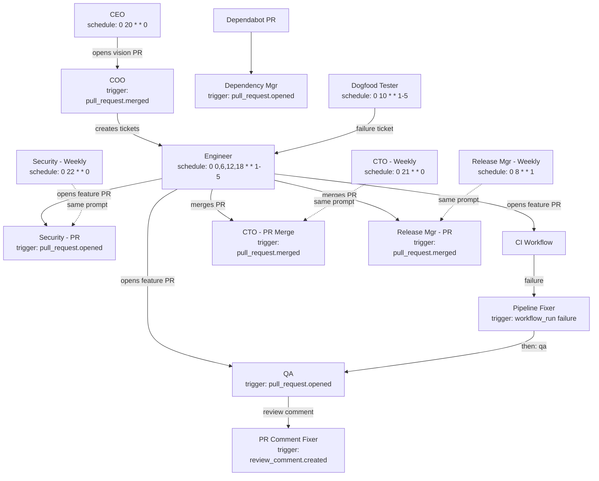

# Trigger Orchestration

**Status:** Draft
**Date:** 2026-04-12
**Author:** Mars Harness contributors

How agent roles are activated: webhook events, cron schedules, and completion chains. Defines the manifest configuration format and the complete role registry derived from the [Mars](https://github.com/elliottgreaves/mars) pipeline.

## Context

The Mars monorepo runs 11 autonomous roles (14 Cursor automation entries) through a combination of GitHub Actions cron schedules, webhook events (PR open, PR merge, CI failure, review comments), and implicit agent-to-agent chaining. That orchestration is split across `automations.yml`, `cursor-pr-automations-dispatch.yml`, `ci.yml`, and `release.yml` — all Cursor-specific infrastructure.

Mars Harness must express the same pipeline in a single `.harness/manifest.yaml` without depending on Cursor or GitHub Actions as the orchestrator. The harness itself is the orchestrator.

## Key Design Decisions

### AD-016: Three trigger source types (webhook, schedule, chain)

All role activation flows through one of three sources:

1. **Webhook** — GitHub sends an event (PR opened, CI failed, review comment). The trigger router matches it to registered roles.
2. **Schedule** — Cron-based activation. The scheduler fires at the specified time and enqueues a job.
3. **Chain** — A completed job immediately enqueues follow-up roles via the `then` field.

No expression parser in v1 — triggers are simple `type.action` pattern strings, cron expressions, or role name references. This maps directly to the three job paths in Mars's `automations.yml`: schedule-driven, event-driven, and workflow_dispatch (manual).

### AD-017: Upstream chaining via `then` field

Agent-to-agent sequencing is declared on the **upstream** role (`then: [qa]`), not the downstream. The upstream role "knows" what should happen next; downstream roles stay reusable without coupling to who calls them.

Two chaining patterns are distinguished:

- **Direct chain** (`then`) — immediate enqueue after successful completion. Used when role B needs to verify role A's work on the same repo state. Example: pipeline-fixer completes fix → run QA on the same branch.
- **Event-mediated chain** — role A produces a side effect (opens a PR, pushes a commit) that generates a GitHub webhook event, which triggers role B through its existing `triggers` list. Example: engineer opens PR → GitHub sends `pull_request.opened` → QA fires. This requires no new mechanism.

The `then` field only handles direct chains. Event-mediated chains happen naturally through existing webhook triggers.

### AD-018: Fire-and-forget completion hook, not a full event bus

Agent chaining uses a simple `OnComplete` callback on the worker pool rather than a general-purpose pub/sub event bus. When a job succeeds, the callback loads the manifest, reads `then`, and enqueues follow-up jobs.

This keeps complexity minimal for v1. If future needs arise (external webhooks on completion, analytics, multi-deployment fan-out), the `OnComplete` hook is the natural extension point for an event bus.

### AD-019: Custom cron with named presets as aliases

The `schedule` field on a role accepts either:

- A raw 5-field cron expression: `"0 0,6,12,18 * * 1-5"` (Engineer: 4x/day weekdays)
- A named preset: `hourly`, `daily`, `weekly`, `monthly`

Presets expand to cron at schedule registration time. Standard 5-field only — no second-resolution or year-field cron. This supports every schedule pattern used in Mars's `automations.yml`.

### AD-020: Dual-mode roles are separate manifest entries

Roles that operate in two modes (e.g., CTO on PR merge vs CTO weekly audit) are expressed as **separate role entries** in the manifest (`cto-pr-merge`, `cto-weekly`). They may share the same prompt file but differ in model tier, tools, triggers, and schedule.

This matches how Mars configures them as separate Cursor automations with distinct models and tool sets (e.g., CTO Weekly uses Opus 4.6 / reasoning tier; CTO PR Merge uses Sonnet 4.6 / coding tier).

## Pipeline Graph

The complete Mars pipeline as it maps to manifest configuration:



Solid arrows are runtime data flow. Dashed arrows show dual-mode roles sharing prompts.

## Complete Role Registry

Derived from `mars/.github/workflows/automations.yml`, `mars/docs/automations/BOTS.md`, and `mars/docs/automations/README.md`.

| # | Role | Manifest Key | Trigger | Schedule (cron) | Chain (`then`) | Model Tier |
|---|------|-------------|---------|-----------------|----------------|------------|
| 1 | CEO | `ceo` | — | `0 20 * * 0` (Sun 8pm) | — | reasoning |
| 2 | COO | `coo` | `pull_request.merged` (vision PR) | — | — | reasoning |
| 3 | CTO (PR) | `cto-pr-merge` | `pull_request.merged` | — | — | coding |
| 4 | CTO (Weekly) | `cto-weekly` | — | `0 21 * * 0` (Sun 9pm) | — | reasoning |
| 5 | Engineer | `engineer` | — | `0 0,6,12,18 * * 1-5` (4x/day) | — | coding |
| 6 | QA | `qa` | `pull_request.opened`, `.synchronize` | — | — | fast |
| 7 | Security (PR) | `security-pr` | `pull_request.opened` | — | — | reasoning |
| 8 | Security (Weekly) | `security-weekly` | — | `0 22 * * 0` (Sun 10pm) | — | reasoning |
| 9 | Dependency Mgr | `dependency-manager` | `pull_request.opened` | — | — | fast |
| 10 | Release Mgr (PR) | `release-pr` | `pull_request.merged` | — | — | coding |
| 11 | Release Mgr (Weekly) | `release-weekly` | — | `0 8 * * 1` (Mon 8am) | — | reasoning |
| 12 | Dogfood Tester | `dogfood` | — | `0 10 * * 1-5` (daily 10am) | — | coding |
| 13 | Pipeline Fixer | `pipeline-fixer` | `workflow_run.conclusion == "failure"` | — | `[qa]` | coding |
| 14 | PR Comment Fixer | `pr-comment-fixer` | `pull_request_review_comment.created` | — | — | fast |

## Reference Manifest

The full `.harness/manifest.yaml` expressing all 14 role entries:

```yaml
name: mars
description: Full Mars pipeline — 11 roles, 14 trigger entries

roles:
  ceo:
    prompt: roles/ceo-vision.md
    model: reasoning
    schedule: "0 20 * * 0"
    tools: [file_read, file_write, shell_exec, grep]

  coo:
    prompt: roles/coo-tickets.md
    model: reasoning
    triggers:
      - pull_request.merged
    tools: [file_read, file_write, shell_exec, grep]

  cto-pr-merge:
    prompt: roles/cto-harness.md
    model: coding
    triggers:
      - pull_request.merged
    tools: [file_read, file_write, shell_exec, grep]

  cto-weekly:
    prompt: roles/cto-harness.md
    model: reasoning
    schedule: "0 21 * * 0"
    tools: [file_read, file_write, shell_exec, grep]

  engineer:
    prompt: roles/engineer-delivery.md
    model: coding
    schedule: "0 0,6,12,18 * * 1-5"
    tools: [file_read, file_write, shell_exec, grep]

  qa:
    prompt: roles/qa-health.md
    model: fast
    triggers:
      - pull_request.opened
      - pull_request.synchronize
    tools: [file_read, grep]

  security-pr:
    prompt: roles/security-officer.md
    model: reasoning
    triggers:
      - pull_request.opened
    tools: [file_read, grep]

  security-weekly:
    prompt: roles/security-officer.md
    model: reasoning
    schedule: "0 22 * * 0"
    tools: [file_read, file_write, shell_exec, grep]

  dependency-manager:
    prompt: roles/dependency-manager.md
    model: fast
    triggers:
      - pull_request.opened
    tools: [file_read, grep]

  release-pr:
    prompt: roles/release-manager.md
    model: coding
    triggers:
      - pull_request.merged
    tools: [file_read, file_write, shell_exec, grep]

  release-weekly:
    prompt: roles/release-manager.md
    model: reasoning
    schedule: "0 8 * * 1"
    tools: [file_read, file_write, shell_exec, grep]

  dogfood:
    prompt: roles/dogfood-tester.md
    model: coding
    schedule: "0 10 * * 1-5"
    tools: [file_read, file_write, shell_exec, grep]

  pipeline-fixer:
    prompt: roles/pipeline-fixer.md
    model: coding
    triggers:
      - workflow_run.conclusion == "failure"
    then: [qa]
    tools: [file_read, file_write, shell_exec, grep]

  pr-comment-fixer:
    prompt: roles/pr-comment-fixer.md
    model: fast
    triggers:
      - pull_request_review_comment.created
    tools: [file_read, file_write, shell_exec, grep]
```

## Discoveries

_(None yet.)_
