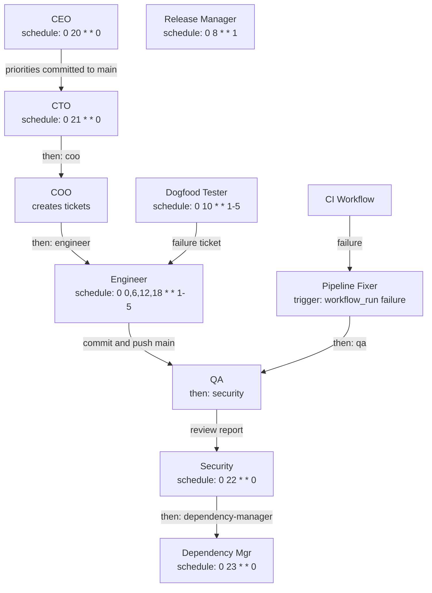

# Trigger Orchestration

**Status:** Draft
**Date:** 2026-04-12
**Author:** Mars Harness contributors

How agent roles are activated: optional webhook events, cron schedules, and completion chains. Defines the manifest configuration format and the strict-trunk role registry derived from the [Mars](https://github.com/elliottgreaves/mars) pipeline.

## Context

The Mars monorepo proved the autonomous role model through Cursor-specific automation. Mars Harness keeps the roles, but changes the delivery contract: work lands as bounded semantic commits on `main`, with optional GitHub events used for checks, status, comments, and webhooks rather than as the core delivery model.

Mars Harness must express the same pipeline in a single `.harness/manifest.yaml` without depending on Cursor or GitHub Actions as the orchestrator. The harness itself is the orchestrator.

## Key Design Decisions

### AD-016: Three trigger source types (webhook, schedule, chain)

All role activation flows through one of three sources:

1. **Webhook** — GitHub or another integration sends an event such as CI failure, check completion, or external feedback. The trigger router matches it to registered roles.
2. **Schedule** — Cron-based activation. The scheduler fires at the specified time and enqueues a job.
3. **Chain** — A completed job immediately enqueues follow-up roles via the `then` field.

No expression parser in v1 — triggers are simple `type.action` pattern strings, cron expressions, or role name references. This maps directly to schedule-driven, event-driven, and manual job paths.

### AD-017: Upstream chaining via `then` field

Agent-to-agent sequencing is declared on the **upstream** role (`then: [qa]`), not the downstream. The upstream role "knows" what should happen next; downstream roles stay reusable without coupling to who calls them.

Two chaining patterns are distinguished:

- **Direct chain** (`then`) — immediate enqueue after successful completion. Used when role B needs to verify role A's work on the same repo state. Example: pipeline-fixer completes fix → run QA on the same trunk commit.
- **Event-mediated chain** — role A produces a side effect such as a pushed commit or failed check that generates an integration event, which triggers role B through its existing `triggers` list.

The `then` field only handles direct chains. Event-mediated chains happen naturally through existing webhook triggers.

### AD-018: Fire-and-forget completion hook, not a full event bus

Agent chaining uses a simple `OnComplete` callback on the worker pool rather than a general-purpose pub/sub event bus. When a job succeeds, the callback loads the manifest, reads `then`, and enqueues follow-up jobs.

This keeps complexity minimal for v1. If future needs arise (external webhooks on completion, analytics, multi-deployment fan-out), the `OnComplete` hook is the natural extension point for an event bus.

### AD-019: Custom cron with named presets as aliases

The `schedule` field on a role accepts either:

- A raw 5-field cron expression: `"0 0,6,12,18 * * 1-5"` (Engineer: 4x/day weekdays)
- A named preset: `hourly`, `daily`, `weekly`, `monthly`

Presets expand to cron at schedule registration time. Standard 5-field only — no second-resolution or year-field cron. This supports every schedule pattern used in Mars's `automations.yml`.

### AD-020: Strict trunk keeps default roles single-purpose

Default roles are expressed around schedules and direct chains, not external review-system modes. If a deployment needs compatibility event handlers, it can add separate entries explicitly, but generated bundles do not include review/merge compatibility roles.

## Pipeline Graph

The default strict-trunk pipeline as it maps to manifest configuration:



Solid arrows are runtime data flow. Every mutating role commits and pushes directly to `main` within trust and safety limits.

## Complete Role Registry

Derived from the Mars role set and normalized for strict trunk delivery.

| # | Role | Manifest Key | Trigger | Schedule (cron) | Chain (`then`) | Model Tier |
|---|------|-------------|---------|-----------------|----------------|------------|
| 1 | CEO | `ceo` | — | `0 20 * * 0` (Sun 8pm) | `[cto-weekly]` | reasoning |
| 2 | CTO | `cto-weekly` | — | `0 21 * * 0` (Sun 9pm) | `[coo]` | reasoning |
| 3 | COO | `coo` | — | — | `[engineer]` | reasoning |
| 4 | Engineer | `engineer` | — | `0 0,6,12,18 * * 1-5` (4x/day) | `[qa, engineer, dogfood]` | coding |
| 5 | QA | `qa` | — | — | `[security]` | fast |
| 6 | Security | `security` | — | `0 22 * * 0` (Sun 10pm) | `[dependency-manager]` | reasoning |
| 7 | Dependency Mgr | `dependency-manager` | — | `0 23 * * 0` (Sun 11pm) | — | fast |
| 8 | Release Mgr | `release-manager` | — | `0 8 * * 1` (Mon 8am) | — | reasoning |
| 9 | Dogfood Tester | `dogfood` | — | `0 10 * * 1-5` (daily 10am) | — | coding |
| 10 | Pipeline Fixer | `pipeline-fixer` | `workflow_run.conclusion == "failure"` | — | `[qa]` | coding |
| 11 | Janitor | `janitor` | — | `0 7 * * *` (daily 7am) | — | fast |

## Reference Manifest

The full `.harness/manifest.yaml` expressing the default strict-trunk roles:

```yaml
name: mars
description: Full Mars Harness pipeline — strict trunk, 11 roles

roles:
  ceo:
    prompt: roles/ceo-vision.md
    model: reasoning
    schedule: "0 20 * * 0"
    then: [cto-weekly]
    tools: [file_read, file_write, shell_exec, grep]

  coo:
    prompt: roles/coo-tickets.md
    model: reasoning
    then: [engineer]
    tools: [file_read, file_write, shell_exec, grep]

  cto-weekly:
    prompt: roles/cto-harness.md
    model: reasoning
    schedule: "0 21 * * 0"
    then: [coo]
    tools: [file_read, file_write, shell_exec, grep]

  engineer:
    prompt: roles/engineer-delivery.md
    model: coding
    schedule: "0 0,6,12,18 * * 1-5"
    tools: [file_read, file_write, shell_exec, grep]

  qa:
    prompt: roles/qa-health.md
    model: fast
    then: [security]
    tools: [file_read, grep]

  security:
    prompt: roles/security-officer.md
    model: reasoning
    schedule: "0 22 * * 0"
    then: [dependency-manager]
    tools: [file_read, file_write, shell_exec, grep]

  dependency-manager:
    prompt: roles/dependency-manager.md
    model: fast
    schedule: "0 23 * * 0"
    tools: [file_read, file_write, shell_exec, grep]

  release-manager:
    prompt: roles/release-manager.md
    model: reasoning
    schedule: "0 8 * * 1"
    tools: [file_read, file_write, shell_exec, grep]

  dogfood:
    prompt: roles/dogfood-tester.md
    model: coding
    schedule: "0 10 * * 1-5"
    tools: [file_read, file_write, shell_exec, grep]

  pipeline-fixer:
    prompt: roles/pipeline-fixer.md
    model: coding
    triggers:
      - workflow_run.conclusion == "failure"
    then: [qa]
    tools: [file_read, file_write, shell_exec, grep]

  janitor:
    prompt: roles/janitor.md
    model: fast
    schedule: "0 7 * * *"
    tools: [file_read, file_write, shell_exec, grep]
```

## Discoveries

_(None yet.)_
