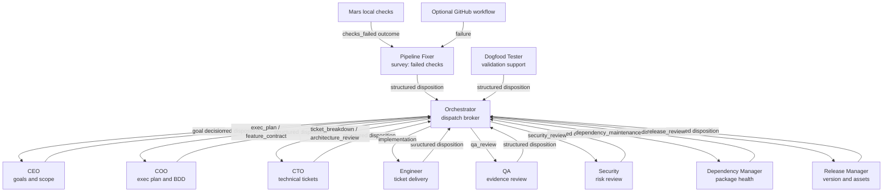

# Trigger Orchestration

**Status:** Draft
**Date:** 2026-04-12
**Author:** MARS contributors

How agent roles are activated: optional webhook events, cron schedules, and completion chains. Defines the manifest configuration format and the strict-trunk role registry derived from the [Mars](https://github.com/elliottgreaves/mars) pipeline. Role routing uses the canonical domain and mode vocabulary from [harness-operating-model.md](harness-operating-model.md).

## Context

The Mars monorepo proved the autonomous role model through Cursor-specific automation. MARS keeps the roles, but changes the delivery contract: work lands as bounded semantic commits on `main`, with optional GitHub events used for checks, status, comments, and webhooks rather than as the core delivery model.

MARS must express the same pipeline in a single `.harness/manifest.yaml` without depending on Cursor or GitHub Actions as the orchestrator. The harness itself is the orchestrator.

## Key Design Decisions

### AD-016: Three trigger source types (webhook, schedule, chain)

All role activation flows through one of three sources:

1. **Webhook** — GitHub or another integration sends an event such as CI failure, check completion, or external feedback. The trigger router matches it to registered roles.
2. **Schedule** — Cron-based activation. The scheduler fires at the specified time and enqueues a job.
3. **Chain** — A completed job immediately enqueues follow-up roles via the `then` field.

No expression parser in v1 — triggers are simple `type.action` pattern strings, cron expressions, or role name references. This maps directly to schedule-driven, event-driven, and manual job paths.

### AD-017: Upstream chaining via `then` field

Agent-to-agent sequencing is declared on the **upstream** role (`then: [qa]`), not the downstream. The upstream role "knows" what should happen next; downstream roles stay reusable without coupling to who calls them.

Two chaining patterns are distinguished:

- **Direct chain** (`then`) — immediate enqueue after successful completion. Used when role B needs to verify role A's work on the same repo state. Example: pipeline-fixer completes fix → run QA on the same trunk commit.
- **Event-mediated chain** — role A produces a side effect such as a pushed commit or failed check that generates an integration event, which triggers role B through its existing `triggers` list.

The `then` field only handles direct chains. Event-mediated chains happen naturally through existing webhook triggers.

### AD-018: Fire-and-forget completion hook, not a full event bus

Agent chaining uses a simple `OnComplete` callback on the worker pool rather than a general-purpose pub/sub event bus. When a job succeeds, the callback loads the manifest, reads `then`, and enqueues follow-up jobs.

This keeps complexity minimal for v1. If future needs arise (external webhooks on completion, analytics, multi-deployment fan-out), the `OnComplete` hook is the natural extension point for an event bus.

### AD-019: Custom cron with named presets as aliases

The `schedule` field on a role accepts either:

- A raw 5-field cron expression: `"0 0,6,12,18 * * 1-5"` (Engineer: 4x/day weekdays)
- A named preset: `hourly`, `daily`, `weekly`, `monthly`

Presets expand to cron at schedule registration time. Standard 5-field only — no second-resolution or year-field cron. This supports every schedule pattern used in Mars's `automations.yml`.

### AD-020: Strict trunk keeps default roles explicit and domain-shaped

Default roles are expressed around schedules and direct chains, not external
review-system modes. Generated bundles keep explicit role keys because those
keys own prompts, schedules, chains, tools, trust, scoring, and guardrails. The
canonical six-domain model is expressed through optional `domain` and `mode`
metadata on each role rather than by replacing the role keys with only six
manifest entries.

Existing manifests without `domain` and `mode` remain valid. New generated
manifests include those fields so routing, registry, trace, score, and
self-improvement work can speak the same role-model vocabulary.

### AD-089: Native Orchestrator Surveys Are A Fourth Internal Signal Source

Webhook, schedule, and chain remain the manifest-facing trigger sources.
Inside `serve`, the Orchestrator also runs a native survey loop on startup and
on a watchdog interval. This survey reads repo-local queue state, tickets,
recent scored outcomes, telemetry patterns, low score snapshots, recovery
jobs, and stuck running jobs without requiring a GitHub event or a newly
completed agent run.

Survey-routed jobs use the same SQLite queue as manifest triggers, but carry
extra ownership metadata:

- `payload_mode` names the work shape exposed in role prompt context, such as
  `ticket_delivery`, `ticket_hygiene`, `pipeline_repair`,
  `dogfood_failure`, or `intervention_debt`.
- `concurrency_group` prevents duplicate work on the same ticket, check
  class, dogfood failure, no-op signal, or release-style global lane.
- `daily_cap` bounds repeated retry storms even when the source signal remains
  present across surveys.
- Recent same-role runtime failures such as `max_turns` pause ticket-owner
  survey routing for the cooldown window, so an eligible in-progress ticket does
  not bypass runtime-failure containment by immediately spawning another
  Engineer job.
- Manifest schedules check the queue for pending, claimed, or running work with
  the same repo and role before enqueueing. A schedule may fire every minute for
  catch-up, but it should not stack another product worker behind an active
  lifecycle for the same role.

Running jobs are no longer reset by normal claim polling. Claimed jobs can
still be reclaimed after a short lease timeout, while running jobs are only
failed by the Orchestrator watchdog after a long stuck-work window. This avoids
interrupting healthy long-running agent work while still surfacing silent
stalls.

## Pipeline Graph

The default strict-trunk pipeline as it maps to manifest configuration:



Solid arrows are runtime data flow. Every mutating role commits and pushes directly to `main` within trust and safety limits.

## Complete Role Registry

Derived from the Mars role set and normalized for strict trunk delivery.

| # | Role | Manifest Key | Domain | Mode | Trigger | Schedule (cron) | Chain (`then`) | Model Tier |
|---|------|-------------|--------|------|---------|-----------------|----------------|------------|
| 1 | CEO | `ceo` | planner | `strategy` | — | `0 20 * * 0` (Sun 8pm) | Orchestrator -> COO | reasoning |
| 2 | COO | `coo` | planner | `execution-planning` | — | — | Orchestrator -> CTO | reasoning |
| 3 | CTO | `cto-weekly` | planner | `technical-planning` | — | `0 21 * * 0` (Sun 9pm) | Orchestrator -> Engineer | reasoning |
| 4 | Engineer | `engineer` | engineer | `ticket-delivery` | — | `0 0,6,12,18 * * 1-5` (4x/day) | `[qa, engineer, dogfood]` | coding |
| 5 | QA | `qa` | reviewer | `quality-review` | — | — | `[security]` | fast |
| 6 | Security | `security` | reviewer | `security-review` | — | `0 22 * * 0` (Sun 10pm) | `[dependency-manager]` | reasoning |
| 7 | Dependency Mgr | `dependency-manager` | maintainer | `dependency-maintenance` | — | `0 23 * * 0` (Sun 11pm) | — | fast |
| 8 | Release Mgr | `release-manager` | maintainer | `release-management` | — | `0 8 * * 1` (Mon 8am) | — | reasoning |
| 9 | Dogfood Tester | `dogfood` | end-to-end-tester | `dogfood-validation` | — | `0 10 * * 1-5` (daily 10am) | — | coding |
| 10 | Pipeline Fixer | `pipeline-fixer` | engineer | `pipeline-repair` | Native survey for `checks_failed`; optional `workflow_run.conclusion == "failure"` integration | — | `[qa]` | coding |
| 11 | Janitor | `janitor` | orchestrator | `ticket-hygiene` | — | `0 7 * * *` (daily 7am) | — | fast |

## Reference Manifest

The full `.harness/manifest.yaml` expressing the default strict-trunk roles:

```yaml
name: mars
description: Full MARS pipeline — strict trunk, 11 roles

roles:
  ceo:
    prompt: roles/ceo-vision.md
    domain: planner
    mode: strategy
    model: reasoning
    schedule: "0 20 * * 0"
    tools: [file_read, file_write, shell_exec, grep]

  coo:
    prompt: roles/coo-tickets.md
    domain: planner
    mode: execution-planning
    model: reasoning
    tools: [file_read, file_write, shell_exec, grep]

  cto-weekly:
    prompt: roles/cto-harness.md
    domain: planner
    mode: technical-planning
    model: reasoning
    schedule: "0 21 * * 0"
    tools: [file_read, file_write, shell_exec, grep]

  engineer:
    prompt: roles/engineer-delivery.md
    domain: engineer
    mode: ticket-delivery
    model: coding
    schedule: "0 0,6,12,18 * * 1-5"
    tools: [file_read, file_write, shell_exec, grep]

  qa:
    prompt: roles/qa-health.md
    domain: reviewer
    mode: quality-review
    model: fast
    then: [security]
    tools: [file_read, grep]

  security:
    prompt: roles/security-officer.md
    domain: reviewer
    mode: security-review
    model: reasoning
    schedule: "0 22 * * 0"
    then: [dependency-manager]
    tools: [file_read, file_write, shell_exec, grep]

  dependency-manager:
    prompt: roles/dependency-manager.md
    domain: maintainer
    mode: dependency-maintenance
    model: fast
    schedule: "0 23 * * 0"
    tools: [file_read, file_write, shell_exec, grep]

  release-manager:
    prompt: roles/release-manager.md
    domain: maintainer
    mode: release-management
    model: reasoning
    schedule: "0 8 * * 1"
    tools: [file_read, file_write, shell_exec, grep]

  dogfood:
    prompt: roles/dogfood-tester.md
    domain: end-to-end-tester
    mode: dogfood-validation
    model: coding
    schedule: "0 10 * * 1-5"
    tools: [file_read, file_write, shell_exec, grep]

  pipeline-fixer:
    prompt: roles/pipeline-fixer.md
    domain: engineer
    mode: pipeline-repair
    model: coding
    triggers:
      - workflow_run.conclusion == "failure"
    # Mars-recorded failed checks route through the native Orchestrator survey.
    then: [qa]
    tools: [file_read, file_write, shell_exec, grep]

  janitor:
    prompt: roles/janitor.md
    domain: orchestrator
    mode: ticket-hygiene
    model: fast
    schedule: "0 7 * * *"
    tools: [file_read, file_write, shell_exec, grep]
```

## Discoveries

_(None yet.)_
